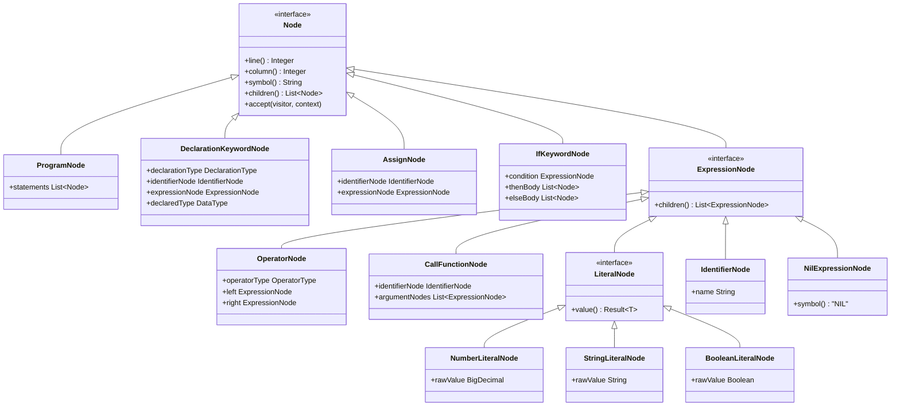
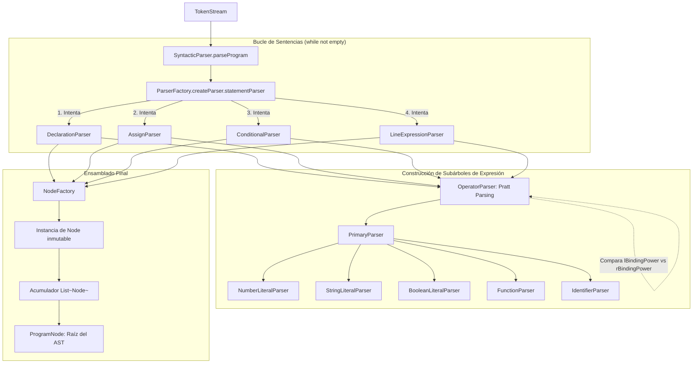
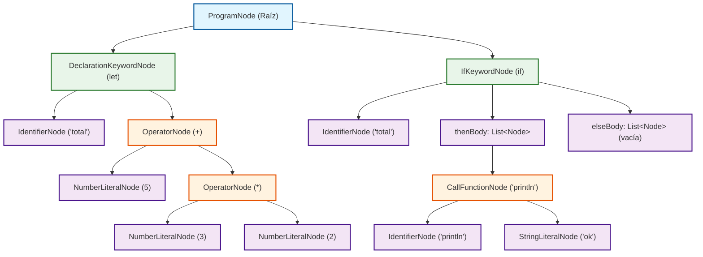

# Construcción de Árboles Sintácticos (AST) y Runtimes en PrintScript

---

## 1. Introducción y Concepto de AST en PrintScript

En **PrintScript**, el **Árbol de Sintaxis Abstracta (AST)** es la estructura intermedia fundamental producida por el analizador sintáctico ([`com.ingsis.parser`](file:///home/elchurro274/Faculty/ingsis/PrintScript/com.ingsis.parser)) a partir del flujo de fichas léxicas ([`TokenStream`](file:///home/elchurro274/Faculty/ingsis/PrintScript/com.ingsis.common/src/main/java/tokenstream/TokenStream.java)). 

El AST representa jerárquicamente la estructura lógica del programa fuente despojada de detalles puramente tipográficos (como espacios en blanco, comentarios o puntos y comas), pero preservando metadatos críticos como coordenadas espaciales ([`line`](file:///home/elchurro274/Faculty/ingsis/PrintScript/com.ingsis.common/src/main/java/node/Node.java#L12) y [`column`](file:///home/elchurro274/Faculty/ingsis/PrintScript/com.ingsis.common/src/main/java/node/Node.java#L14)) para mensajes de diagnóstico, análisis estático y formateo.

Todos los nodos implementan la interfaz común [`Node`](file:///home/elchurro274/Faculty/ingsis/PrintScript/com.ingsis.common/src/main/java/node/Node.java), garantizando:
- **Inmutabilidad absoluta:** Implementados como `record` de Java con listas copiadas defensivamente ([`List.copyOf`](file:///home/elchurro274/Faculty/ingsis/PrintScript/com.ingsis.common/src/main/java/node/ProgramNode.java#L13)).
- **Patrón Composite:** Cada nodo expone [`children()`](file:///home/elchurro274/Faculty/ingsis/PrintScript/com.ingsis.common/src/main/java/node/Node.java#L18) para recorridos genéricos uniformes.
- **Patrón Visitor:** Cada nodo implementa [`accept(NodeVisitor<R, C> visitor, C context)`](file:///home/elchurro274/Faculty/ingsis/PrintScript/com.ingsis.common/src/main/java/node/Node.java#L20) para desacoplar el árbol de su ejecución, validación o formateo.

---

## 2. Taxonomía del AST: ¿Qué Nodos son las Cabezas?

El árbol sintáctico se organiza en una jerarquía estricta de **tres niveles de nodos**:
1. **La Raíz Global** (Cabeza del Programa).
2. **Las Cabezas de Sentencia** (Statement Heads).
3. **Las Cabezas de Expresión y Nodos Hoja** (Expression Subtrees & Leaves).



### 2.1. Nodo Raíz Global: `ProgramNode`
* **Definición:** [`ProgramNode(List<Node> statements, Integer line, Integer column)`](file:///home/elchurro274/Faculty/ingsis/PrintScript/com.ingsis.common/src/main/java/node/ProgramNode.java)
* **Rol:** Es la cabeza suprema de todo script parseado. Sus hijos directos son exclusivamente sentencias de primer nivel en el orden secuencial en el que fueron leídas.

### 2.2. Cabezas de Sentencia (Statements)
Son los nodos que representan instrucciones completas que terminan con delimitadores (como `;` o `}`):

| Nodo Cabeza | Representación Sintáctica | Hijos Directos ([`children()`](file:///home/elchurro274/Faculty/ingsis/PrintScript/com.ingsis.common/src/main/java/node/Node.java#L18)) | Rol Estructural |
|---|---|---|---|
| [`DeclarationKeywordNode`](file:///home/elchurro274/Faculty/ingsis/PrintScript/com.ingsis.common/src/main/java/node/keyword/DeclarationKeywordNode.java) | `let x: number = 10;`<br>`const y: string = "a";`<br>`let z: boolean;` | `[identifierNode, expressionNode]` | Declara una variable en el ámbito actual. Si no hay inicialización, `expressionNode` apunta a un [`NilExpressionNode`](file:///home/elchurro274/Faculty/ingsis/PrintScript/com.ingsis.common/src/main/java/node/expression/nullObject/NilExpressionNode.java). |
| [`AssignNode`](file:///home/elchurro274/Faculty/ingsis/PrintScript/com.ingsis.common/src/main/java/node/keyword/AssignNode.java) | `x = 20;` | `[identifierNode, expressionNode]` | Reasigna un nuevo valor a una variable ya existente en el ámbito. |
| [`IfKeywordNode`](file:///home/elchurro274/Faculty/ingsis/PrintScript/com.ingsis.common/src/main/java/node/keyword/IfKeywordNode.java) | `if (cond) { ... } else { ... }` | `[condition] + thenBody + elseBody` | Nodo de bifurcación condicional. Posee como subárboles una expresión y dos listas de sentencias hijas. |
| [`CallFunctionNode`](file:///home/elchurro274/Faculty/ingsis/PrintScript/com.ingsis.common/src/main/java/node/expression/function/CallFunctionNode.java) | `println("Hola");` | `[identifierNode] + argumentNodes` | Utilizado como sentencia de línea (*line expression*) para llamadas con efectos secundarios. |

### 2.3. Cabezas de Expresión (Expression Subtrees)
Nodos que calculan y devuelven un valor. Pueden anidarse recursivamente:

| Nodo Cabeza | Representación Sintáctica | Subárboles Hijos |
|---|---|---|
| [`OperatorNode`](file:///home/elchurro274/Faculty/ingsis/PrintScript/com.ingsis.common/src/main/java/node/expression/operator/OperatorNode.java) | `a + b`, `x * y / 2` | `[left, right]` (expresión izquierda y derecha). |
| [`CallFunctionNode`](file:///home/elchurro274/Faculty/ingsis/PrintScript/com.ingsis.common/src/main/java/node/expression/function/CallFunctionNode.java) | `readEnv("PATH")`, `readInput("Edad: ")` | `[identifierNode] + argumentNodes`. |

### 2.4. Nodos Hoja o Terminales (Leaves)
Son los puntos finales del árbol sintáctico sin hijos subordinados (`children().isEmpty() == true`):
* [`NumberLiteralNode`](file:///home/elchurro274/Faculty/ingsis/PrintScript/com.ingsis.common/src/main/java/node/expression/literal/NumberLiteralNode.java): Números de precisión arbitraria ([`BigDecimal`](file:///home/elchurro274/Faculty/ingsis/PrintScript/com.ingsis.common/src/main/java/node/expression/literal/NumberLiteralNode.java#L14)).
* [`StringLiteralNode`](file:///home/elchurro274/Faculty/ingsis/PrintScript/com.ingsis.common/src/main/java/node/expression/literal/StringLiteralNode.java): Texto literal.
* [`BooleanLiteralNode`](file:///home/elchurro274/Faculty/ingsis/PrintScript/com.ingsis.common/src/main/java/node/expression/literal/BooleanLiteralNode.java): Valores `true` o `false`.
* [`IdentifierNode`](file:///home/elchurro274/Faculty/ingsis/PrintScript/com.ingsis.common/src/main/java/node/expression/Identifier/IdentifierNode.java): Referencia a una variable o función por nombre.
* [`NilExpressionNode`](file:///home/elchurro274/Faculty/ingsis/PrintScript/com.ingsis.common/src/main/java/node/expression/nullObject/NilExpressionNode.java): Patrón Null Object para ausencia de expresión.

---

## 3. La Secuencia de Construcción del Árbol (Parsing Pipeline)

La transformación de un flujo de tokens en el AST sigue un algoritmo descendente recursivo guiado por estrategias de versión y el algoritmo de Pratt Parsing para operadores:



### Paso 1: Inicialización y Bucle Principal
En [`SyntacticParser.java`](file:///home/elchurro274/Faculty/ingsis/PrintScript/com.ingsis.parser/src/main/java/syntactic/SyntacticParser.java#L37):
1. El método [`parseProgram(stream)`](file:///home/elchurro274/Faculty/ingsis/PrintScript/com.ingsis.parser/src/main/java/syntactic/SyntacticParser.java#L37-L54) inicializa una lista mutable `statements`.
2. Itera mientras `!currentStream.isEmpty()`.
3. En cada iteración invoca `parseStatement(currentStream)`, el cual delega en la cadena de parsers configurada por [`ParserFactory`](file:///home/elchurro274/Faculty/ingsis/PrintScript/com.ingsis.parser/src/main/java/syntactic/parser/ParserFactory.java#L37).
4. El parser de sentencia exitoso devuelve un [`IterationStep<Node>`](file:///home/elchurro274/Faculty/ingsis/PrintScript/com.ingsis.common/src/main/java/iterator/IterationStep.java), cuyo nodo se agrega a la lista y el `TokenStream` se actualiza al puntero subsiguiente.

### Paso 2: Selección de Estrategia por Versión
[`ParserFactory`](file:///home/elchurro274/Faculty/ingsis/PrintScript/com.ingsis.parser/src/main/java/syntactic/parser/ParserFactory.java) consulta el [`VersionStrategyRegistry`](file:///home/elchurro274/Faculty/ingsis/PrintScript/com.ingsis.parser/src/main/java/syntactic/version/VersionStrategyRegistry.java):
* En **PrintScript 1.0** ([`Version10Strategy`](file:///home/elchurro274/Faculty/ingsis/PrintScript/com.ingsis.parser/src/main/java/syntactic/version/Version10Strategy.java)): Solo habilita palabras clave `let`, tipos `number` y `string`, y no incluye soporte para condicionales `if/else` ni literales booleanos.
* En **PrintScript 1.1** ([`Version11Strategy`](file:///home/elchurro274/Faculty/ingsis/PrintScript/com.ingsis.parser/src/main/java/syntactic/version/Version11Strategy.java)): Incorpora `const`, `if/else`, tipo `boolean`, y literales booleanos.

### Paso 3: Resolución de Precedencia con Pratt Parsing
Para cualquier expresión aritmética o lógica (en asignaciones, condiciones o inicializaciones), se utiliza el algoritmo de **Pratt Parsing** en [`OperatorParser`](file:///home/elchurro274/Faculty/ingsis/PrintScript/com.ingsis.parser/src/main/java/syntactic/parser/operator/OperatorParser.java):
1. Se parsea el operando izquierdo mediante `primaryParser` (que resuelve literales, identificadores o llamadas a función).
2. Se inspecciona el siguiente token en el stream. Si es un operador binario (`+`, `-`, `*`, `/`), se consulta su [`OperatorType`](file:///home/elchurro274/Faculty/ingsis/PrintScript/com.ingsis.common/src/main/java/node/expression/operator/OperatorType.java):
   ```java
   PLUS("+", 12, 11),
   MINUS("-", 12, 11),
   STAR("*", 22, 21),
   SLASH("/", 22, 21);
   ```
3. **Mecánica del Algoritmo:**
   - Si la expresión es `10 + 20 * 30`:
     - El parser consume `10` y ve `+` (potencia de ligadura derecha = 11).
     - Al entrar recursivamente para procesar el lado derecho, encuentra `20` y luego el operador `*` (potencia de ligadura izquierda = 22).
     - Como `22 > 11`, el operador `*` "atrae" a `20` y `30` con mayor fuerza, construyendo primero el subárbol `(20 * 30)`.
     - Finalmente, el nodo `+` toma a `10` a la izquierda y al subárbol `(20 * 30)` a la derecha.

### Paso 4: Ejemplo Visual de Árbol Construido
Para el siguiente código fuente:
```javascript
let total: number = 5 + 3 * 2;
if (total) {
    println("ok");
}
```
El árbol generado posee la siguiente estructura exacta:



---

## 4. Funcionamiento Detallado de la Sentencia `if`

La sentencia `if` está soportada a partir de **PrintScript 1.1** y se compone de un bloque `then` obligatorio y un bloque `else` opcional.

### 4.1. Análisis Sintáctico: `ConditionalParser`
En [`ConditionalParser.java`](file:///home/elchurro274/Faculty/ingsis/PrintScript/com.ingsis.parser/src/main/java/syntactic/parser/root/ConditionalParser.java):
1. **Consumo de cabecera:** Consume estrictamente `TokenType.IF`, seguido del delimitador `TokenType.LPAREN`.
2. **Parseo de condición:** Delega al `conditionParser` para extraer la expresión condicional y luego consume `TokenType.RPAREN`.
3. **Parseo del bloque `then`:** Invoca [`BlockParserUtils.parseBlock`](file:///home/elchurro274/Faculty/ingsis/PrintScript/com.ingsis.parser/src/main/java/syntactic/util/BlockParserUtils.java), el cual espera `SymbolType.LBRACE` (`{`), ejecuta repetidamente el `statementParser` hasta encontrar `SymbolType.RBRACE` (`}`), produciendo `List<Node> thenBody`.
4. **Resolución de `else` con Strategy:** Se consultan las estrategias registradas:
   - [`WithElseStrategy`](file:///home/elchurro274/Faculty/ingsis/PrintScript/com.ingsis.parser/src/main/java/syntactic/strategy/WithElseStrategy.java): Si el siguiente token es `TokenType.ELSE`, consume `else`, abre llave `{`, parsea las sentencias y cierra llave `}`, emitiendo `List<Node> elseBody`.
   - [`WithoutElseStrategy`](file:///home/elchurro274/Faculty/ingsis/PrintScript/com.ingsis.parser/src/main/java/syntactic/strategy/WithoutElseStrategy.java): Si no hay token `else`, asigna una lista vacía inmutable `List.of()` para `elseBody`.
5. **Construcción:** Retorna un [`IfKeywordNode(condition, thenBody, elseBody, line, column)`](file:///home/elchurro274/Faculty/ingsis/PrintScript/com.ingsis.common/src/main/java/node/keyword/IfKeywordNode.java).

### 4.2. Validación Semántica: `IfNodeSemanticHandler`
En [`IfNodeSemanticHandler.java`](file:///home/elchurro274/Faculty/ingsis/PrintScript/com.ingsis.parser/src/main/java/semantic/handler/IfNodeSemanticHandler.java):
1. Verifica mediante [`ExpressionTypeInference`](file:///home/elchurro274/Faculty/ingsis/PrintScript/com.ingsis.parser/src/main/java/semantic/evaluator/ExpressionTypeInference.java) que la condición sea de tipo [`DataType.BOOLEAN`](file:///home/elchurro274/Faculty/ingsis/PrintScript/com.ingsis.common/src/main/java/node/expression/literal/DataType.java#L12). Si la condición evalúa a `number` o `string`, se emite un fallo semántico sin llegar a ejecución.
2. Crea entornos semánticos hijos (`env.createChild()`) para validar que las declaraciones internas dentro de `thenBody` y `elseBody` sean coherentes y no colisionen indebidamente con variables externas.

### 4.3. Ejecución en Runtime: `DefaultStatementExecutor.executeIf`
En [`DefaultStatementExecutor.java`](file:///home/elchurro274/Faculty/ingsis/PrintScript/com.ingsis.interpreter/src/main/java/executor/DefaultStatementExecutor.java#L90-L107):
```java
private Result<Void> executeIf(IfKeywordNode ifNode, Environment env) {
    Result<Object> condRes = expressionEvaluator.evaluate(ifNode.condition(), env);
    if (!condRes.isCorrect()) return Result.failure(((IncorrectResult<Object>) condRes).error());

    Object conditionValue = ((CorrectResult<Object>) condRes).value();
    if (!(conditionValue instanceof Boolean boolCond)) {
        return Result.failure("Condition of 'if' statement must evaluate to a boolean value");
    }

    // Aislamiento de ámbito (Scope anidado)
    Environment blockEnv = new Environment(env);
    List<Node> bodyToExecute = boolCond ? ifNode.thenBody() : ifNode.elseBody();
    for (Node stmt : bodyToExecute) {
        Result<Void> execRes = execute(stmt, blockEnv);
        if (!execRes.isCorrect()) return execRes;
    }
    return Result.success(null);
}
```
* **Aislamiento de Ámbito:** Se instancia `new Environment(env)`, lo cual crea un entorno léxico subordinado. Las variables declaradas dentro del bloque condicional mueren al finalizar el bloque, pero cualquier reasignación a variables externas mutables persiste en el entorno padre.

---

## 5. Funcionamiento Detallado de `readEnv` y `readInput`

Tanto `readEnv` como `readInput` están diseñadas como **funciones nativas del lenguaje** (*Built-in Functions*). A nivel de parser no son palabras clave especiales, sino que son tratadas polimórficamente como llamadas a funciones regulares ([`CallFunctionNode`](file:///home/elchurro274/Faculty/ingsis/PrintScript/com.ingsis.common/src/main/java/node/expression/function/CallFunctionNode.java)), mientras que su lógica de evaluación reside desacoplada en el módulo de interpretación.

### 5.1. La Función `readEnv`
Permite obtener valores de variables de entorno del sistema operativo (por ejemplo: `let port: string = readEnv("PORT");`).

#### A. Nivel Sintáctico (Parsing)
* El [`FunctionParser`](file:///home/elchurro274/Faculty/ingsis/PrintScript/com.ingsis.parser/src/main/java/syntactic/parser/root/FunctionParser.java) reconoce el identificador `"readEnv"` seguido de los paréntesis `(` y `)`.
* Construye un [`CallFunctionNode`](file:///home/elchurro274/Faculty/ingsis/PrintScript/com.ingsis.common/src/main/java/node/expression/function/CallFunctionNode.java) con argumento de tipo [`StringLiteralNode`](file:///home/elchurro274/Faculty/ingsis/PrintScript/com.ingsis.common/src/main/java/node/expression/literal/StringLiteralNode.java).

#### B. Nivel Semántico (Type Inference)
* En [`ExpressionTypeInference.java`](file:///home/elchurro274/Faculty/ingsis/PrintScript/com.ingsis.parser/src/main/java/semantic/evaluator/ExpressionTypeInference.java#L73-L79):
  ```java
  private Result<DataType> inferFunctionType(CallFunctionNode call, SemanticEnvironment env) {
      String fnName = call.identifierNode().name();
      if ("readInput".equalsIgnoreCase(fnName) || "readEnv".equalsIgnoreCase(fnName)) {
          return Result.success(null); // Tipo polimórfico diferido
      }
      return Result.success(DataType.STRING);
  }
  ```
* Al retornar `null` en tiempo de análisis semántico, [`DeclarationNodeSemanticHandler`](file:///home/elchurro274/Faculty/ingsis/PrintScript/com.ingsis.parser/src/main/java/semantic/handler/DeclarationNodeSemanticHandler.java#L49) permite asignar el resultado de `readEnv` a **cualquier tipo de dato declarado** (`string`, `number` o `boolean`), difiriendo la validación del formato al runtime.

#### C. Nivel de Ejecución: `ReadEnvFunction`
En [`ReadEnvFunction.java`](file:///home/elchurro274/Faculty/ingsis/PrintScript/com.ingsis.interpreter/src/main/java/builtin/ReadEnvFunction.java):
1. **Inyección del Proveedor:** Utiliza la interfaz funcional [`EnvProvider`](file:///home/elchurro274/Faculty/ingsis/PrintScript/com.ingsis.interpreter/src/main/java/builtin/provider/EnvProvider.java), cuyo valor por defecto es `System::getenv`. Esto permite inyectar mocks controlados en tests unitarios.
2. **Búsqueda y Coerción Tipada:**
   - Lee el nombre de la variable desde los argumentos (`arguments.get(0)`).
   - Consulta al proveedor. Si no está definida, lanza un error de runtime explícito: `"Runtime error: Environment variable '<name>' is not set"`.
   - Aplica el método privado `coerce(String raw, DataType targetType)` según el tipo de la variable receptora:
     * `DataType.STRING` $\rightarrow$ Retorna el string sin alterar.
     * `DataType.NUMBER` $\rightarrow$ Parsea mediante `new BigDecimal(raw.trim())`.
     * `DataType.BOOLEAN` $\rightarrow$ Interpreta `"true"` a `Boolean.TRUE` y `"false"` a `Boolean.FALSE`. Cualquier otro texto falla con error descriptivo.

---

### 5.2. La Función `readInput`
Permite solicitar entrada interactiva al usuario a través de la terminal o consola estándar (por ejemplo: `let edad: number = readInput("Ingresa tu edad: ");`).

#### A. Nivel Sintáctico (Parsing)
* El [`FunctionParser`](file:///home/elchurro274/Faculty/ingsis/PrintScript/com.ingsis.parser/src/main/java/syntactic/parser/root/FunctionParser.java) genera un [`CallFunctionNode`](file:///home/elchurro274/Faculty/ingsis/PrintScript/com.ingsis.common/src/main/java/node/expression/function/CallFunctionNode.java) con el prompt opcional como argumento.

#### B. Nivel de Ejecución: `ReadInputFunction`
En [`ReadInputFunction.java`](file:///home/elchurro274/Faculty/ingsis/PrintScript/com.ingsis.interpreter/src/main/java/builtin/ReadInputFunction.java):
1. **Inyección del Proveedor de Entrada:** Se desacopla mediante [`InputProvider`](file:///home/elchurro274/Faculty/ingsis/PrintScript/com.ingsis.interpreter/src/main/java/builtin/provider/InputProvider.java):
   ```java
   @FunctionalInterface
   public interface InputProvider {
       String readInput(String name);
   }
   ```
2. **Protocolo de Interacción:**
   - Si se pasó un prompt en los argumentos, lo emite a través de `Consumer<String> outputEmitter` para que se muestre en pantalla antes de pausar la ejecución.
   - Invoca a `inputProvider.readInput(prompt)` para obtener la respuesta del usuario.
   - Aplica la coerción de tipos correspondiente (`STRING`, `NUMBER` con `BigDecimal`, o `BOOLEAN`), garantizando consistencia tipográfica con la variable que recibe el resultado.

---

## 6. Otros Elementos Clave del Sistema ("y así")

### 6.1. La Función `println`
* A diferencia de `readEnv` y `readInput` (que producen valores dentro de expresiones), `println` suele invocarse como **sentencia independiente**:
  `println("Resultado: " + total);`
* **Parseo:** [`LineExpressionParser`](file:///home/elchurro274/Faculty/ingsis/PrintScript/com.ingsis.parser/src/main/java/syntactic/parser/root/LineExpressionParser.java) consume la llamada a función y el punto y coma final `;`.
* **Ejecución:** [`PrintlnFunction`](file:///home/elchurro274/Faculty/ingsis/PrintScript/com.ingsis.interpreter/src/main/java/builtin/PrintlnFunction.java) recibe los argumentos evaluados, concatena su representación textual y los envía directamente al `outputEmitter` configurado (por ejemplo, `System.out::println` o un buffer de pruebas).

### 6.2. Declaraciones: `let` vs `const`
PrintScript distingue variables mutables de constantes inmutables mediante el enum [`DeclarationType`](file:///home/elchurro274/Faculty/ingsis/PrintScript/com.ingsis.common/src/main/java/node/keyword/declaration/DeclarationType.java):
* **`let`:** Registra la variable con la bandera `isMutable = true`. Permite reasignaciones posteriores mediante [`AssignNode`](file:///home/elchurro274/Faculty/ingsis/PrintScript/com.ingsis.common/src/main/java/node/keyword/AssignNode.java).
* **`const`:** Registra la variable con `isMutable = false`. Exige inicialización inmediata (no permite [`NilExpressionNode`](file:///home/elchurro274/Faculty/ingsis/PrintScript/com.ingsis.common/src/main/java/node/expression/nullObject/NilExpressionNode.java)) y cualquier intento posterior de reasignación es rechazado tanto por el analizador semántico como por el entorno de ejecución (`"Cannot reassign constant variable"`).

### 6.3. Jerarquía de Entornos Léxicos (`Environment`)
En [`Environment.java`](file:///home/elchurro274/Faculty/ingsis/PrintScript/com.ingsis.interpreter/src/main/java/environment/Environment.java):
* Los ámbitos se organizan en una estructura de árbol enlazada hacia el padre (`parent`).
* **Búsqueda de Variables (`get`):** Busca localmente en el mapa de variables actual. Si no existe, delega recursivamente en el entorno padre (`parent.get(...)`), soportando clausuras léxicas y ámbitos anidados en cascada.
* **Asignación (`assign`):** Recorre la cadena hacia arriba para modificar la variable en el ámbito exacto donde fue declarada, respetando si es mutable.

---

## 7. Tabla Resumen: Comparativa de Construcción y Ejecución

| Elemento | Nodo en el AST | Cabeza / Subárbol | Rol en Parseo | Comportamiento en Intérprete |
|---|---|---|---|---|
| **`ProgramNode`** | [`ProgramNode`](file:///home/elchurro274/Faculty/ingsis/PrintScript/com.ingsis.common/src/main/java/node/ProgramNode.java) | Cabeza Raíz Global | Contenedor secuencial de sentencias | Itera y ejecuta cada sentencia en orden secuencial |
| **`let` / `const`** | [`DeclarationKeywordNode`](file:///home/elchurro274/Faculty/ingsis/PrintScript/com.ingsis.common/src/main/java/node/keyword/DeclarationKeywordNode.java) | Cabeza de Sentencia | Parsea tipo, identificador y expresión asignada | Registra símbolo en el `Environment` (mutable o constante) |
| **`x = expr`** | [`AssignNode`](file:///home/elchurro274/Faculty/ingsis/PrintScript/com.ingsis.common/src/main/java/node/keyword/AssignNode.java) | Cabeza de Sentencia | Parsea identificador de destino y nueva expresión | Actualiza el valor en el `Environment` verificando mutabilidad |
| **`if / else`** | [`IfKeywordNode`](file:///home/elchurro274/Faculty/ingsis/PrintScript/com.ingsis.common/src/main/java/node/keyword/IfKeywordNode.java) | Cabeza de Sentencia | Parsea condición y bloques `{ then }` / `{ else }` | Evalúa condición booleana y ejecuta en un nuevo `Environment` anidado |
| **`readEnv`** | [`CallFunctionNode`](file:///home/elchurro274/Faculty/ingsis/PrintScript/com.ingsis.common/src/main/java/node/expression/function/CallFunctionNode.java) | Subárbol de Expresión | Parsea llamada con nombre de variable de entorno | Consulta `EnvProvider` y coacciona dinámicamente a `targetType` |
| **`readInput`** | [`CallFunctionNode`](file:///home/elchurro274/Faculty/ingsis/PrintScript/com.ingsis.common/src/main/java/node/expression/function/CallFunctionNode.java) | Subárbol de Expresión | Parsea llamada con mensaje de prompt | Emite prompt, lee de `InputProvider` y coacciona a `targetType` |
| **`println`** | [`CallFunctionNode`](file:///home/elchurro274/Faculty/ingsis/PrintScript/com.ingsis.common/src/main/java/node/expression/function/CallFunctionNode.java) | Sentencia o Expresión | Parsea argumentos entre paréntesis | Evalúa argumentos y los emite a través de `outputEmitter` |
| **Operaciones (`+`, `*`)** | [`OperatorNode`](file:///home/elchurro274/Faculty/ingsis/PrintScript/com.ingsis.common/src/main/java/node/expression/operator/OperatorNode.java) | Subárbol de Expresión | Resuelto mediante potencias de ligadura (Pratt) | Realiza aritmética en `BigDecimal` o concatenación con `String` |
| **Literales** | [`NumberLiteralNode`](file:///home/elchurro274/Faculty/ingsis/PrintScript/com.ingsis.common/src/main/java/node/expression/literal/NumberLiteralNode.java), etc. | Nodos Hoja (Terminales) | Extrae valores literales sin hijos sintácticos | Retorna el valor encapsulado directamente |
