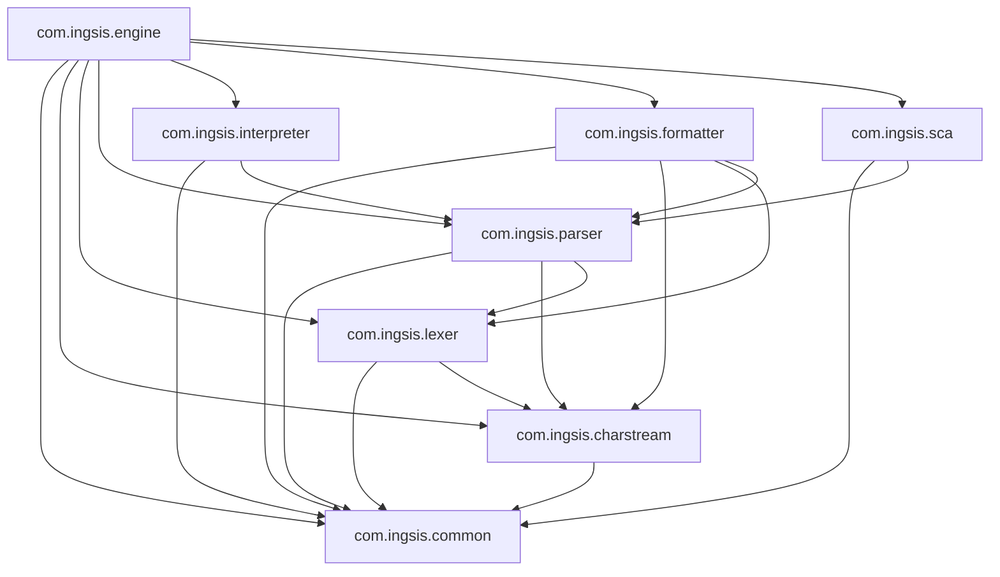
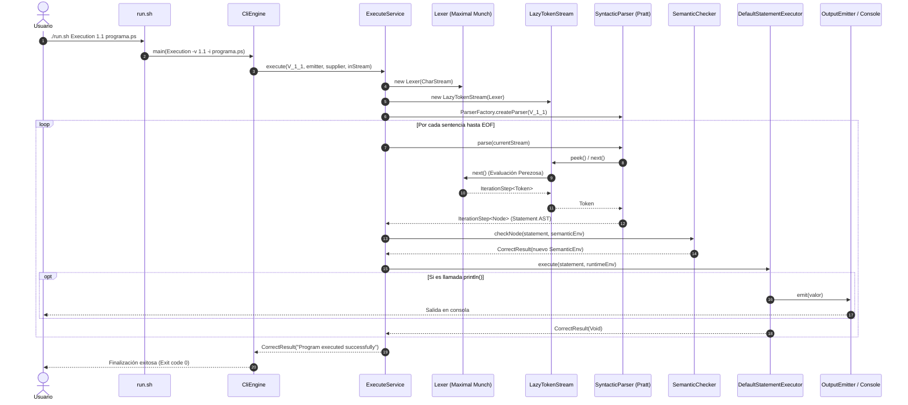

# Documento Completo de Arquitectura, Decisiones de Diseño y Ejecución de PrintScript

---

## Tabla de Contenidos
1. [Introducción y Objetivos del Sistema](#1-introducción-y-objetivos-del-sistema)
2. [Decisiones de Diseño Paso a Paso y Patrones Aplicados](#2-decisiones-de-diseño-paso-a-paso-y-patrones-aplicados)
   - [2.1. Evaluación Perezosa y Streaming con `SafeIterator<T>`](#21-evaluación-perezosa-y-streaming-con-safeiteratort)
   - [2.2. Manejo Funcional de Errores con la Mónada `Result<T>`](#22-manejo-funcional-de-errores-con-la-mónada-resultt)
   - [2.3. Algoritmo Maximal Munch con Lookahead Pushback](#23-algoritmo-maximal-munch-con-lookahead-pushback)
   - [2.4. Algoritmo Pratt Parsing (Precedencia de Operadores)](#24-algoritmo-pratt-parsing-precedencia-de-operadores)
   - [2.5. Patrón Visitor con Dispatch Polimórfico y Handlers Desacoplados](#25-patrón-visitor-con-dispatch-polimórfico-y-handlers-desacoplados)
   - [2.6. Soporte Multi-Versión con Strategy y Factory](#26-soporte-multi-versión-con-strategy-y-factory)
   - [2.7. Inmutabilidad y Tipado Estricto con Java Records](#27-inmutabilidad-y-tipado-estricto-con-java-records)
   - [2.8. Aplicación Rigurosa de Principios SOLID](#28-aplicación-rigurosa-de-principios-solid)
3. [Estructura del Sistema y Detalle de Módulos](#3-estructura-del-sistema-y-detalle-de-módulos)
   - [3.1. Módulo `com.ingsis.common`](#31-módulo-comingsiscommon)
   - [3.2. Módulo `com.ingsis.charstream`](#32-módulo-comingsischarstream)
   - [3.3. Módulo `com.ingsis.lexer`](#33-módulo-comingsislexer)
   - [3.4. Módulo `com.ingsis.parser`](#34-módulo-comingsisparser)
   - [3.5. Módulo `com.ingsis.interpreter`](#35-módulo-comingsisinterpreter)
   - [3.6. Módulo `com.ingsis.formatter`](#36-módulo-comingsisformatter)
   - [3.7. Módulo `com.ingsis.sca`](#37-módulo-comingsissca)
   - [3.8. Módulo `com.ingsis.engine`](#38-módulo-comingsisengine)
4. [Orquestación del Sistema y Relación entre Componentes](#4-orquestación-del-sistema-y-relación-entre-componentes)
   - [4.1. Diagrama Modular y Dependencias](#41-diagrama-modular-y-dependencias)
   - [4.2. Flujo de Ejecución (Execution / Interpretation)](#42-flujo-de-ejecución-execution--interpretation)
   - [4.3. Flujo de Validación (Validation)](#43-flujo-de-validación-validation)
   - [4.4. Flujo de Formateo (Formatting)](#44-flujo-de-formateo-formatting)
   - [4.5. Flujo de Análisis Estático (Analyzing / SCA)](#45-flujo-de-análisis-estático-analyzing--sca)
5. [Guía de Ejecución y Operación del Programa](#5-guía-de-ejecución-y-operación-del-programa)
   - [5.1. Uso del Script `run.sh`](#51-uso-del-script-runsh)
   - [5.2. Modo Archivo vs Modo REPL Interactivo](#52-modo-archivo-vs-modo-repl-interactivo)
   - [5.3. Configuración YAML para Formatter y SCA](#53-configuración-yaml-para-formatter-y-sca)
   - [5.4. Pruebas Unitarias y de Integración](#54-pruebas-unitarias-y-de-integración)

---

## 1. Introducción y Objetivos del Sistema

**PrintScript** es un entorno de desarrollo, ejecución, formateo y análisis estático para un lenguaje de programación educativo fuertemente tipado. El sistema ha sido concebido bajo restricciones estrictas de ingeniería de software:
- **Consumo de memoria constante $O(1)$** en el procesamiento léxico/sintáctico mediante streaming perezoso.
- **Cero excepciones para control de flujo** en el core del compilador mediante tipos de resultado algebraicos.
- **Alta cohesión y bajo acoplamiento** dividiendo el proyecto en 8 módulos Gradle independientes.
- **Soporte evolutivo para múltiples versiones del lenguaje** (v1.0 y v1.1) sin duplicación de código ni condicionales intrusivos.

---

## 2. Decisiones de Diseño Paso a Paso y Patrones Aplicados

### 2.1. Evaluación Perezosa y Streaming con `SafeIterator<T>`
* **Problema:** Un enfoque tradicional que lee todo el archivo a un `String` o genera un `List<Token>` completo falla ante archivos fuente que superen la memoria RAM disponible.
* **Decisión de Diseño:** Cada elemento de la cadena de entrada se procesa bajo demanda utilizando la interfaz genérica `SafeIterator<T>`.
* **Implementación:**
  ```java
  public interface SafeIterator<T> {
      Result<IterationStep<T>> next();
      default void unread(T item) {}
  }
  ```
  La invocación de `next()` produce un `IterationStep<T>` que encapsula el elemento actual (`value()`) y la referencia inmutable al siguiente iterador (`next()`). Esto permite avanzar en el flujo carácter a carácter y token a token sin almacenar colecciones intermedias.

### 2.2. Manejo Funcional de Errores con la Mónada `Result<T>`
* **Problema:** Las excepciones (`throw Exception`) introducen saltos ocultos en el flujo de control, degradan el rendimiento y dificultan razonar formalmente sobre el estado del compilador.
* **Decisión de Diseño:** Adopción de la mónada `Result<T>` estructurada como interfaz sellada (`sealed interface`) con dos variantes directas:
  - `CorrectResult<T>(T value)`: Representa la computación exitosa portando el dato resultante.
  - `IncorrectResult<T>(String error)`: Representa un fallo sintáctico, semántico, léxico o de ejecución con su correspondiente mensaje descriptivo y coordenadas espaciales.
* **Beneficio:** Uso exhaustivo de *Pattern Matching* en Java (`switch (result)`), garantizando que ningún camino de error sea ignorado en tiempo de compilación.

### 2.3. Algoritmo Maximal Munch con Lookahead Pushback
* **Problema:** Determinar inequívocamente los límites de un token cuando existen prefijos compartidos (por ejemplo, el operador `=` frente a `==`, o el identificador `letter` frente a la keyword `let`).
* **Decisión de Diseño:** En `com.ingsis.lexer.Lexer`, se implementa el principio de *Maximal Munch* (la regla de coincidencia más larga).
* **Mecanismo:**
  1. El lexer acumula caracteres en un `MetaCharStringBuilder` y consulta periódicamente al `Tokenizer`.
  2. Si el acumulado es un prefijo potencial (`TokenizeResult.Prefix`), continúa leyendo.
  3. Si es un token completo (`TokenizeResult.Complete`), lo registra como candidato óptimo pero continúa inspeccionando si es posible extenderlo.
  4. Cuando se lee un carácter que invalida la regla (`TokenizeResult.Invalid`), el lexer detiene la lectura y devuelve (`unread`) al `CharStream` todos los caracteres que formaban parte del lookahead posterior al último token válido encontrado.

### 2.4. Algoritmo Pratt Parsing (Precedencia de Operadores)
* **Problema:** El análisis de expresiones aritmético-lógicas (con operadores `+`, `-`, `*`, `/`, `>`, `<`, `==`, `!=`) requiere manejar precedencias y asociatividad sin caer en gramáticas complejas con recursión infinita por izquierda.
* **Decisión de Diseño:** Se implementa un parser *Top-Down Operator Precedence (Pratt Parser)* en `OperatorParser`.
* **Mecanismo:** A cada operador binario se le asigna un *binding power* numérico (ej. `*` y `/` poseen mayor precedencia que `+` y `-`). El parser consume expresiones primarias y va ligando operadores a la derecha únicamente si la precedencia del operador entrante supera el umbral del operador actual.

### 2.5. Patrón Visitor con Dispatch Polimórfico y Handlers Desacoplados
* **Problema:** Operaciones como validación semántica, formateo y análisis estático (*SCA*) necesitan recorrer el Árbol de Sintaxis Abstracta (AST) sin contaminar los nodos del AST con lógica externa ajena a su definición estructural.
* **Decisión de Diseño:** Se implementa el patrón **Visitor** mediante `NodeVisitor<R, C>`. A su vez, para evitar métodos `visit()` monolíticos, cada visitante (`SemanticChecker`, `ASTSca`, `ASTFormatter`) delega la inspección de cada subtipo de nodo en un diccionario de `Handlers` registrados por `Class<? extends Node>`.
* **Beneficio:** Cumplimiento estricto del principio *Open/Closed (OCP)*: agregar una nueva regla de validación o un nuevo tipo de nodo no requiere modificar las clases existentes.

### 2.6. Soporte Multi-Versión con Strategy y Factory
* **Problema:** El lenguaje evoluciona entre versiones (PrintScript 1.0 vs PrintScript 1.1) con nuevas palabras clave (`const`), nuevos tipos (`boolean`), nuevas estructuras (`if-else`) y nuevas funciones integradas (`readInput`, `readEnv`).
* **Decisión de Diseño:** Uso del patrón **Strategy** (`VersionStrategy`, `Version10Strategy`, `Version11Strategy`) combinado con la fábrica `ParserFactory`.
* **Mecanismo:** `ParserFactory.createParser(version)` selecciona la estrategia correspondiente, la cual inyecta únicamente los parsers de sentencias y expresiones primarias autorizados para dicha versión.

### 2.7. Inmutabilidad y Tipado Estricto con Java Records
* **Problema:** Efectos secundarios y mutaciones de estado concurrentes o accidentales en modelos de datos.
* **Decisión de Diseño:** Todos los modelos atómicos (`Position`, `MetaCharacter`, `Token`, `IterationStep`, y la jerarquía de nodos `DeclarationKeywordNode`, `AssignNode`, `IfKeywordNode`, `CallFunctionNode`, etc.) están implementados como `record` de Java, garantizando inmutabilidad total.

### 2.8. Aplicación Rigurosa de Principios SOLID
- **Single Responsibility Principle (SRP):** Cada clase realiza una tarea atómica (ej. `PositionTracker` solo calcula líneas y columnas; `SpaceAroundEqualsRule` solo valida espaciado en `=`).
- **Open/Closed Principle (OCP):** Nuevas reglas de formato o SCA se incorporan implementando `FormattingRule` o `ScaNodeHandler` sin tocar el motor principal.
- **Liskov Substitution Principle (LSP):** Cualquier implementación de `SafeIterator<T>`, `TokenStream`, `CharReader` o `Parser<T>` puede intercambiarse sin alterar la corrección del pipeline.
- **Interface Segregation Principle (ISP):** Interfaces pequeñas y específicas (`CharReader`, `Tokenizer`, `ExpressionEvaluator`, `StatementExecutor`, `BuiltInFunction`).
- **Dependency Inversion Principle (DIP):** Los componentes de alto nivel (`CliEngine`, `ExecuteService`, `DefaultInterpreter`) dependen de abstracciones (`Interpreter`, `SyntacticParser`, `OutputEmitter`, `InputSupplier`), nunca de implementaciones concretas.

---

## 3. Estructura del Sistema y Detalle de Módulos

```
PrintScript
├── com.ingsis.common       # Núcleo: Modelos AST, Tokens, Result monad, SafeIterator
├── com.ingsis.charstream   # Capa I/O: Lectura de caracteres con posición y pushback
├── com.ingsis.lexer        # Análisis Léxico: Tokenización Maximal Munch
├── com.ingsis.parser       # Análisis Sintáctico (Pratt) y Semántico (Tipos)
├── com.ingsis.interpreter  # Intérprete y ejecución de sentencias en memoria
├── com.ingsis.formatter    # Formateador de código fuente basado en reglas YAML
├── com.ingsis.sca          # Analizador estático de código (Linter) configurable
└── com.ingsis.engine       # CLI (Picocli), servicios fachada y modo REPL
```

### 3.1. Módulo `com.ingsis.common`
Es la base compartida por todos los demás módulos. No tiene dependencias externas internas.
- **`result.Result<T>`**: Mónada funcional con `CorrectResult` e `IncorrectResult`.
- **`iterator.SafeIterator<T>` & `iterator.IterationStep<T>`**: Contrato de streaming perezoso inmutable.
- **`position.Position`**: Almacena `(line, column)` de cada carácter o token.
- **`metaChar.MetaCharacter`**: Tupla `(char, Position)`.
- **`token.Token`, `TokenType`, `SymbolType`**: Representación de tokens con tipo léxico, valor textual y rangos espaciales de inicio y fin.
- **`node.*`**: Jerarquía de nodos AST (`ProgramNode`, `DeclarationKeywordNode`, `AssignNode`, `IfKeywordNode`, `CallFunctionNode`, `OperatorNode`, literales `NumberLiteralNode`, `StringLiteralNode`, `BooleanLiteralNode`).
- **`node.visitor.NodeVisitor<R, C>`**: Interfaz para el patrón visitante.

### 3.2. Módulo `com.ingsis.charstream`
Provee acceso a nivel de caracteres con capacidad de retroceso (*lookahead reversible*).
- **`StreamCharReader`**: Adaptador sobre `java.io.Reader` con un `PushbackReader` interno.
- **`PositionTracker`**: Rastrela línea y columna actual avanzando ante caracteres simples o saltos `\n`.
- **`CharStream`**: Implementa `SafeIterator<MetaCharacter>`. Permite invocar `unread(MetaCharacter)` para reinsertar caracteres no consumidos en el buffer de lectura.

### 3.3. Módulo `com.ingsis.lexer`
Convierte el flujo de caracteres en un flujo de tokens.
- **`PrintScriptTokenizer`**: Clasifica prefijos y caracteres acumulados contra las reglas léxicas del lenguaje.
- **`Lexer`**: Implementa `SafeIterator<Token>` mediante el algoritmo *Maximal Munch*. Descarta espacios en blanco y extrae tokens atómicos manteniendo un consumo de memoria $O(1)$.
- **`MunchState`**: Estructura de estado temporal que mantiene el último token válido reconocido y el buffer de lookahead.

### 3.4. Módulo `com.ingsis.parser`
Se divide funcionalmente en dos capas: sintáctica y semántica.
1. **Capa Sintáctica (`syntactic.*`):**
   - **`LazyTokenStream`**: Implementa `TokenStream` envolviendo el `Lexer` para proveer `peek(n)` e `isEmpty()`.
   - **`SyntacticParser`**: Parser principal que itera sobre el stream extrayendo sentencias mediante el parser compuesto.
   - **`ParserFactory`**: Construye el parser inyectando la `VersionStrategy` adecuada.
   - **Parsers de Sentencia**: `DeclarationParser`, `AssignParser`, `ConditionalParser`, `FunctionParser`, `LineExpressionParser`.
   - **`OperatorParser`**: Pratt Parser para evaluar expresiones binarias y asociatividad.
2. **Capa Semántica (`semantic.*`):**
   - **`SemanticChecker`**: Visitor que recorre el AST validando compatibilidad de tipos y restricciones semánticas.
   - **`SemanticEnvironment`**: Tabla de símbolos que gestiona identificadores, tipos asociados (`NUMBER`, `STRING`, `BOOLEAN`) y mutabilidad (`let` vs `const`) en scopes anidados.
   - **`ExpressionTypeInference`**: Infiere el tipo resultante de expresiones complejas y detecta operaciones ilegales (ej. multiplicar un `string`).
   - **Handlers Semánticos**: `DeclarationNodeSemanticHandler`, `AssignNodeSemanticHandler`, `IfNodeSemanticHandler`, `CallFunctionNodeSemanticHandler`.

### 3.5. Módulo `com.ingsis.interpreter`
Ejecuta el AST interpretando las sentencias en memoria.
- **`DefaultInterpreter`**: Coordina el ciclo `Parse Statement -> Semantic Check -> Execute Statement`.
- **`DefaultStatementExecutor`**: Modifica el entorno en tiempo de ejecución (`Environment`) ejecutando declaraciones, asignaciones y bifurcaciones condicionales `if/else`.
- **`DefaultExpressionEvaluator`**: Calcula el valor concreto de literales, variables y operaciones aritméticas/concatenaciones.
- **`DefaultFunctionRegistry`**: Registro de funciones nativas (`PrintlnFunction`, `ReadInputFunction`, `ReadEnvFunction`).

### 3.6. Módulo `com.ingsis.formatter`
Reescribe código fuente aplicando estilos configurables.
- **`TokenStreamFormatter`**: Analiza pares de tokens sucesivos y ajusta los separadores (espacios y saltos de línea) preservando la integridad del código fuente.
- **Reglas de Formato (`formatter.rule.*`)**: `SpaceBeforeColonRule`, `SpaceAfterColonRule`, `SpaceAroundEqualsRule`, `SpaceAroundOperatorsRule`, `IndentationRule`, `LinesAfterPrintlnRule`, `BracePositionRule`.
- **`YamlFormatRulesLoader`**: Lee archivos YAML de configuración y genera el `FormatContext`.

### 3.7. Módulo `com.ingsis.sca`
Analizador estático de código (*Static Code Analysis / Linter*).
- **`ASTSca`**: Visitor que recorre el AST e inspecciona el cumplimiento de reglas de estilo y buenas prácticas.
- **Handlers de Reglas**:
  - `DeclarationScaHandler`: Valida convenciones de nombrado de variables (`camelCase` vs `snake_case`).
  - `CallFunctionScaHandler`: Verifica restricciones en llamadas a `println` y `readInput` (ej. prohibir literales o expresiones complejas directas).
- **`YamlScaRulesLoader`**: Carga las políticas de análisis desde un archivo YAML a `ScaContext`.

### 3.8. Módulo `com.ingsis.engine`
Punto de entrada unificado y fachada para clientes externos y CLI.
- **`CliEngine`**: Aplicación de consola basada en **Picocli** que gestiona argumentos, opciones y streams de E/S.
- **Servicios Fachada**:
  - `ExecuteService`: Ejecuta programas completos o en streaming interactivo.
  - `ValidationService`: Valida sintaxis y semántica reportando coordenadas de error exactas.
  - `FormatService`: Orquesta la carga de reglas y el formateo de archivos.
  - `LintService`: Ejecuta el análisis estático y emite la lista de infracciones detectadas.

---

## 4. Orquestación del Sistema y Relación entre Componentes

### 4.1. Diagrama Modular y Dependencias



### 4.2. Flujo de Ejecución (Execution / Interpretation)



### 4.3. Flujo de Validación (Validation)
1. `ValidationService` inicializa el pipeline `CharStream -> Lexer -> LazyTokenStream -> SyntacticParser`.
2. Procesa sentencia por sentencia, reportando por consola el progreso de análisis (`Parsing statement N at line X, col Y...`).
3. Ejecuta `SemanticChecker.checkNode()`.
4. Si ocurre cualquier error sintáctico o semántico, detiene el proceso y retorna un `IncorrectResult` detallando las coordenadas `[Line X, Column Y to Line A, Column B]`.

### 4.4. Flujo de Formateo (Formatting)
1. `FormatService` carga el archivo YAML a través de `YamlFormatRulesLoader`.
2. Se instancia `TokenStreamFormatter` con el `FormatContext` correspondiente.
3. Se leen los tokens del stream fuente y se calculan los offsets originales.
4. Para cada par de tokens adyacentes, se aplican secuencialmente las reglas (`SpaceBeforeColonRule`, `SpaceAfterColonRule`, `SpaceAroundEqualsRule`, `SpaceAroundOperatorsRule`, `IndentationRule`, etc.), reconstruyendo el código formateado hacia el `Writer` de salida.

### 4.5. Flujo de Análisis Estático (Analyzing / SCA)
1. `LintService` carga las reglas desde YAML con `YamlScaRulesLoader` e instancia `ASTSca`.
2. El código fuente es parseado completamente a un `ProgramNode` que agrupa todas las sentencias validadas semánticamente.
3. `ASTSca.analyze(programNode, semanticEnv)` visita recursivamente cada nodo del árbol evaluando convenciones de nombrado e invocaciones a funciones nativas.
4. Si no hay violaciones, retorna éxito; si existen infracciones, retorna un reporte con cada mensaje de alerta.

---

## 5. Guía de Ejecución y Operación del Programa

### 5.1. Uso del Script `run.sh`

El script `./run.sh` proporciona una interfaz unificada y robusta que traduce los comandos del usuario a invocaciones de Gradle y Picocli.

```bash
./run.sh [OPERACIÓN] [VERSIÓN] [ARCHIVO_FUENTE] [CONFIG_YAML] [ARCHIVO_SALIDA]
```

#### 1. Validación Sintáctica y Semántica (`Validation`)
Valida la corrección del programa sin ejecutarlo:
```bash
./run.sh Validation 1.0 samples/valid_v10.ps
./run.sh Validation 1.1 samples/valid_v11.ps
```

#### 2. Ejecución del Programa (`Execution`)
Ejecuta el código en la versión indicada:
```bash
./run.sh Execution 1.0 samples/valid_v10.ps
./run.sh Execution 1.1 samples/valid_v11.ps
```

#### 3. Formateo de Código (`Formatting`)
Aplica las reglas de estilo YAML y muestra el resultado en pantalla o en un archivo:
```bash
# Mostrar resultado por consola:
./run.sh Formatting 1.0 samples/unformatted.ps samples/format_rules.yaml

# Guardar en archivo destino:
./run.sh Formatting 1.0 samples/unformatted.ps samples/format_rules.yaml samples/formatted.ps
```

#### 4. Análisis Estático de Código (`Analyzing`)
Ejecuta el linter/SCA según la configuración de reglas:
```bash
./run.sh Analyzing 1.1 samples/sca_test.ps samples/sca_rules.yaml
```

### 5.2. Modo Archivo vs Modo REPL Interactivo
Si se ejecuta la operación `Execution` sin indicar un archivo fuente, el sistema inicia automáticamente en modo **REPL interactivo**:
```bash
./run.sh Execution 1.1
```
En este modo:
- El usuario ingresa líneas de código PrintScript interactivamente en la consola.
- Al presionar una línea vacía, el bloque acumulado se valida e interpreta, manteniendo el estado de variables (`SemanticEnvironment` y `Environment`) en memoria entre una ejecución y otra.
- Para finalizar la sesión, se escribe `exit`.

### 5.3. Configuración YAML para Formatter y SCA

#### Ejemplo de `format_rules.yaml`:
```yaml
spaceBeforeColon: false
spaceAfterColon: true
spaceAroundEquals: true
spaceAroundOperators: true
indentationSpaces: 4
lineBreaksAfterPrintln: 1
```

#### Ejemplo de `sca_rules.yaml`:
```yaml
identifierFormat: camelCase      # Opciones: camelCase | snake_case
enforcePrintlnLiteral: false     # Si es true, restringe argumentos directos
```

### 5.4. Pruebas Unitarias y de Integración
Para ejecutar el conjunto completo de tests automatizados de todos los módulos:
```bash
./gradlew test
```
Salida esperada:
```text
> Task :com.ingsis.common:test PASSED
> Task :com.ingsis.charstream:test PASSED
> Task :com.ingsis.lexer:test PASSED
> Task :com.ingsis.parser:test PASSED
> Task :com.ingsis.formatter:test PASSED
> Task :com.ingsis.sca:test PASSED
> Task :com.ingsis.interpreter:test PASSED
> Task :com.ingsis.engine:test PASSED

BUILD SUCCESSFUL
```
