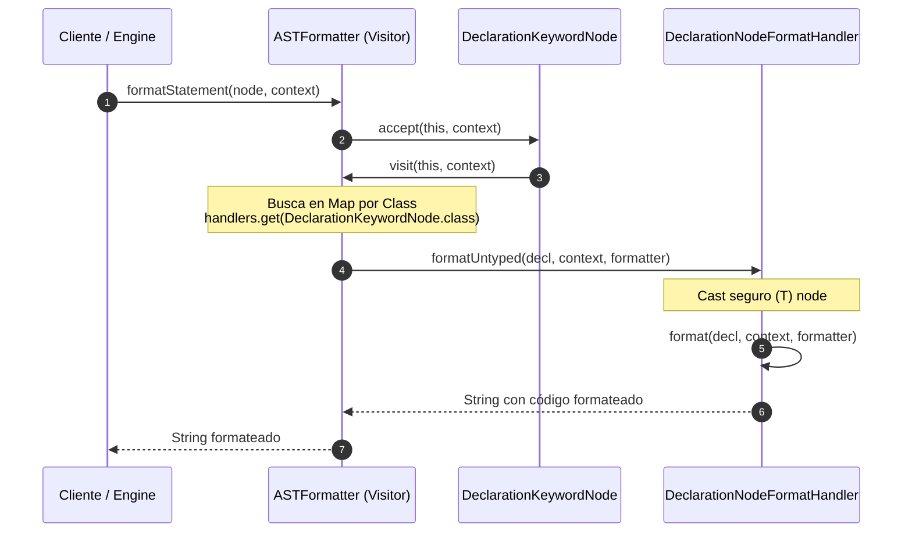

# Manejo de Handlers en el Formatter y Funcionamiento de SCA (Static Code Analysis)

---

## 1. ¿Cómo se Llaman y Manejan los Handlers del Formatter?

En el módulo [`com.ingsis.formatter`](file:///home/elchurro274/Faculty/ingsis/PrintScript/com.ingsis.formatter), el diseño de [`ASTFormatter`](file:///home/elchurro274/Faculty/ingsis/PrintScript/com.ingsis.formatter/src/main/java/formatter/ASTFormatter.java) evita caer en un método gigante plagado de condicionales `if (node instanceof ...)` o en contaminar las clases del AST con lógica de formateo.

Para lograrlo, combina el **Patrón Visitor** ([`NodeVisitor<String, FormatContext>`](file:///home/elchurro274/Faculty/ingsis/PrintScript/com.ingsis.common/src/main/java/node/visitor/NodeVisitor.java)) con un **Diccionario Polimórfico de Handlers** ([`FormatNodeHandler<T>`](file:///home/elchurro274/Faculty/ingsis/PrintScript/com.ingsis.formatter/src/main/java/formatter/handler/FormatNodeHandler.java)).



### 1.1. El Contrato: `FormatNodeHandler<T extends Node>`
En [`FormatNodeHandler.java`](file:///home/elchurro274/Faculty/ingsis/PrintScript/com.ingsis.formatter/src/main/java/formatter/handler/FormatNodeHandler.java):
```java
public interface FormatNodeHandler<T extends Node> {
    Class<T> nodeType();

    String format(T node, FormatContext context, ASTFormatter formatter);

    @SuppressWarnings("unchecked")
    default String formatUntyped(Node node, FormatContext context, ASTFormatter formatter) {
        return format((T) node, context, formatter);
    }
}
```
* **`nodeType()`:** Identifica la clase concreta del AST a la que este handler da soporte (ej: `DeclarationKeywordNode.class`).
* **`formatUntyped(...)` (Bridge Pattern):** Actúa como puente genérico. Recibe un [`Node`](file:///home/elchurro274/Faculty/ingsis/PrintScript/com.ingsis.common/src/main/java/node/Node.java) sin tipar y lo castea de forma segura a `(T) node`, invocando la variante fuertemente tipada `format(T, ...)`.

---

### 1.2. El Registro y Despacho en `ASTFormatter`
En [`ASTFormatter.java`](file:///home/elchurro274/Faculty/ingsis/PrintScript/com.ingsis.formatter/src/main/java/formatter/ASTFormatter.java):

1. **Construcción y Registro:**
   En el constructor, los handlers son registrados en un mapa hash indexados por su clase:
   ```java
   this.handlers = handlerList.stream()
       .collect(Collectors.toMap(FormatNodeHandler::nodeType, h -> h));
   ```
   Por defecto, se instancian:
   - [`DeclarationNodeFormatHandler`](file:///home/elchurro274/Faculty/ingsis/PrintScript/com.ingsis.formatter/src/main/java/formatter/handler/DeclarationNodeFormatHandler.java)
   - [`AssignNodeFormatHandler`](file:///home/elchurro274/Faculty/ingsis/PrintScript/com.ingsis.formatter/src/main/java/formatter/handler/AssignNodeFormatHandler.java)
   - [`IfNodeFormatHandler`](file:///home/elchurro274/Faculty/ingsis/PrintScript/com.ingsis.formatter/src/main/java/formatter/handler/IfNodeFormatHandler.java)
   - [`CallFunctionNodeFormatHandler`](file:///home/elchurro274/Faculty/ingsis/PrintScript/com.ingsis.formatter/src/main/java/formatter/handler/CallFunctionNodeFormatHandler.java)
   - [`ProgramNodeFormatHandler`](file:///home/elchurro274/Faculty/ingsis/PrintScript/com.ingsis.formatter/src/main/java/formatter/handler/ProgramNodeFormatHandler.java)

2. **Despacho Polimórfico Doble (*Double Dispatch*):**
   - Cuando se formatea una sentencia: `formatter.formatStatement(node, context)` invoca `node.accept(this, context)`.
   - El nodo reenvía al método exacto del visitante:
     ```java
     // En DeclarationKeywordNode
     @Override
     public <R, C> R accept(NodeVisitor<R, C> visitor, C context) {
         return visitor.visit(this, context);
     }
     ```
   - En `ASTFormatter`, el método `visit(...)` no implementa reglas directas, sino que **delega en el handler registrado**:
     ```java
     @Override
     public String visit(DeclarationKeywordNode decl, FormatContext context) {
         FormatNodeHandler<?> handler = handlers.get(DeclarationKeywordNode.class);
         return handler != null ? handler.formatUntyped(decl, context, this) : "";
     }
     ```

3. **Recursión y Manejo de Sub-árboles:**
   Los handlers reciben la referencia del propio `ASTFormatter`. Cuando un handler compuesto (como [`IfNodeFormatHandler`](file:///home/elchurro274/Faculty/ingsis/PrintScript/com.ingsis.formatter/src/main/java/formatter/handler/IfNodeFormatHandler.java)) necesita formatear los nodos de su bloque interno:
   - Incrementa el nivel de sangría creando un nuevo contexto inmutable: `FormatContext innerContext = context.incrementIndent();`.
   - Llama recursivamente a `formatter.formatStatement(childStmt, innerContext)`.
   - Esto reactiva el ciclo de despacho para cada hijo, manteniendo las responsabilidades completamente segregadas.

---

## 2. ¿Qué es y Cómo Funciona SCA (Static Code Analysis)?

El módulo [`com.ingsis.sca`](file:///home/elchurro274/Faculty/ingsis/PrintScript/com.ingsis.sca) es el **analizador estático de código (linter)** de PrintScript.

### 2.1. Objetivo y Principio Operativo
A diferencia del intérprete (que ejecuta el código) y del formateador (que modifica el texto), **SCA únicamente inspecciona el AST y el entorno semántico para detectar violaciones a reglas de calidad, estilo y buenas prácticas**, produciendo advertencias o errores diagnósticos sin alterar el código ni ejecutarlo.

---

### 2.2. Arquitectura de SCA: Simetría con el Formatter
[`ASTSca`](file:///home/elchurro274/Faculty/ingsis/PrintScript/com.ingsis.sca/src/main/java/sca/ASTSca.java) utiliza **exactamente el mismo patrón arquitectónico de Visitor + Handlers Desacoplados**:

* Implementa [`NodeVisitor<List<String>, ScaContext>`](file:///home/elchurro274/Faculty/ingsis/PrintScript/com.ingsis.common/src/main/java/node/visitor/NodeVisitor.java) y [`Sca`](file:///home/elchurro274/Faculty/ingsis/PrintScript/com.ingsis.sca/src/main/java/sca/Sca.java).
* Mantiene un `Map<Class<? extends Node>, ScaNodeHandler<?>> handlers`.
* Cada handler implementa [`ScaNodeHandler<T extends Node>`](file:///home/elchurro274/Faculty/ingsis/PrintScript/com.ingsis.sca/src/main/java/sca/handler/ScaNodeHandler.java):
  ```java
  public interface ScaNodeHandler<T extends Node> {
      Class<T> nodeType();

      List<String> check(T node, SemanticEnvironment env, ScaContext context, ASTSca sca);

      @SuppressWarnings("unchecked")
      default List<String> checkUntyped(
              Node node, SemanticEnvironment env, ScaContext context, ASTSca sca) {
          return check((T) node, env, context, sca);
      }
  }
  ```

---

### 2.3. Catálogo de Reglas y Handlers de SCA

El contexto [`ScaContext`](file:///home/elchurro274/Faculty/ingsis/PrintScript/com.ingsis.sca/src/main/java/sca/ScaContext.java) modela las reglas activas:
```java
public record ScaContext(
    String identifierFormat,                               // "camelCase" o "snake_case"
    boolean mandatoryLiteralOrIdentifierInPrintln,         // Restricción en println
    boolean mandatoryLiteralOrIdentifierInReadInput        // Restricción en readInput
)
```

#### Regla 1: Convención de Nombres de Identificadores (`identifier_format`)
* **Handler:** [`DeclarationScaHandler`](file:///home/elchurro274/Faculty/ingsis/PrintScript/com.ingsis.sca/src/main/java/sca/handler/DeclarationScaHandler.java).
* **Mecanismo:** Inspecciona el nombre del identificador en cada declaración (`let` o `const`):
  - **`camelCase`:** Verifica regex `^[a-z]+(?:[A-Z][a-z0-9]*)*$`. Acepta `miVariable`, `contadorTotal`; rechaza `MiVariable` o `mi_variable`.
  - **`snake_case`:** Verifica regex `^[a-z]+(?:_[a-z0-9]+)*$`. Acepta `mi_variable`, `total_count`; rechaza `miVariable` o `MiVariable`.
* **Diagnóstico emitido:**
  `"Identifier 'foo_bar' does not respect camelCase naming convention at line 3, column 5"`

---

#### Regla 2: Restricción de Argumentos en `println` (`mandatory_literal_or_identifier_in_println`)
* **Handler:** [`CallFunctionScaHandler`](file:///home/elchurro274/Faculty/ingsis/PrintScript/com.ingsis.sca/src/main/java/sca/handler/CallFunctionScaHandler.java).
* **Propósito:** Exigir que los argumentos de `println` sean únicamente un literal (número, string, booleano) o una variable previamente calculada, impidiendo expresiones complejas en la llamada.
* **Ejemplos:**
  - ❌ **Violación:** `println(x + 10);` (el argumento es un [`OperatorNode`](file:///home/elchurro274/Faculty/ingsis/PrintScript/com.ingsis.common/src/main/java/node/expression/operator/OperatorNode.java)).
  - ✔️ **Permitido:**
    ```javascript
    let resultado: number = x + 10;
    println(resultado);
    ```
* **Diagnóstico emitido:**
  `"Function 'println' argument at index 0 must be a literal or variable, found expression at line 4, column 9"`

---

#### Regla 3: Restricción de Prompt en `readInput` (`mandatory_literal_or_identifier_in_read_input`)
* **Handler:** [`CallFunctionScaHandler`](file:///home/elchurro274/Faculty/ingsis/PrintScript/com.ingsis.sca/src/main/java/sca/handler/CallFunctionScaHandler.java).
* **Propósito:** Garantizar que el mensaje prompt mostrado al usuario en `readInput` sea una cadena literal fija o una variable, no una expresión calculada al vuelo.
* **Ejemplos:**
  - ❌ **Violación:** `readInput("Usuario " + id + ": ");`
  - ✔️ **Permitido:** `readInput("Ingrese usuario: ");`

---

#### Regla 4: Análisis Recursivo en Bloques `if-else`
* **Handler:** [`IfScaHandler`](file:///home/elchurro274/Faculty/ingsis/PrintScript/com.ingsis.sca/src/main/java/sca/handler/IfScaHandler.java).
* **Mecanismo:** Desciende sobre las sentencias de `thenBody` y `elseBody`, propagando el análisis estático a través de todos los niveles de anidación del programa.

---

### 2.4. Configuración Externa con YAML
Las reglas de SCA se configuran en un archivo YAML desacoplado (por ejemplo, `sca_rules.yaml`):

```yaml
identifier_format: "camelCase"
mandatory_variable_or_literal_in_println: true
mandatory_variable_or_literal_in_read_input: true
```

[`YamlScaRulesLoader.loadFromYaml(InputStream stream)`](file:///home/elchurro274/Faculty/ingsis/PrintScript/com.ingsis.sca/src/main/java/sca/config/YamlScaRulesLoader.java) procesa el archivo y construye la instancia de [`ScaContext`](file:///home/elchurro274/Faculty/ingsis/PrintScript/com.ingsis.sca/src/main/java/sca/ScaContext.java), la cual se inyecta en [`ASTSca`](file:///home/elchurro274/Faculty/ingsis/PrintScript/com.ingsis.sca/src/main/java/sca/ASTSca.java).

---

## 3. Resumen Comparativo de Handlers

| Módulo | Interfaz de Handler | Clase Orquestadora (Visitor) | Retorno del Análisis |
|---|---|---|---|
| **Formatter** | [`FormatNodeHandler<T>`](file:///home/elchurro274/Faculty/ingsis/PrintScript/com.ingsis.formatter/src/main/java/formatter/handler/FormatNodeHandler.java) | [`ASTFormatter`](file:///home/elchurro274/Faculty/ingsis/PrintScript/com.ingsis.formatter/src/main/java/formatter/ASTFormatter.java) | `String` (código fuente reconstruido canónicamente) |
| **SCA (Linter)** | [`ScaNodeHandler<T>`](file:///home/elchurro274/Faculty/ingsis/PrintScript/com.ingsis.sca/src/main/java/sca/handler/ScaNodeHandler.java) | [`ASTSca`](file:///home/elchurro274/Faculty/ingsis/PrintScript/com.ingsis.sca/src/main/java/sca/ASTSca.java) | `List<String>` (reporte de infracciones y coordenadas) |
