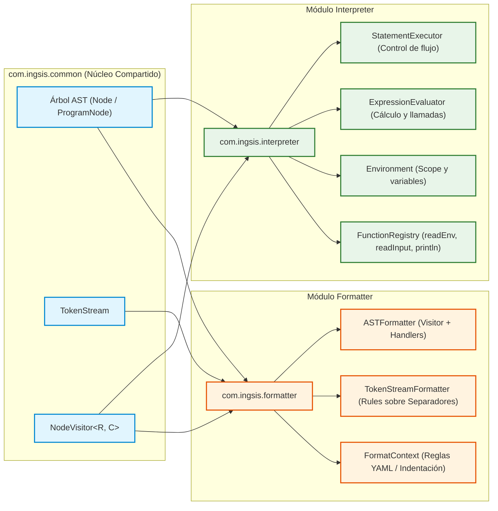
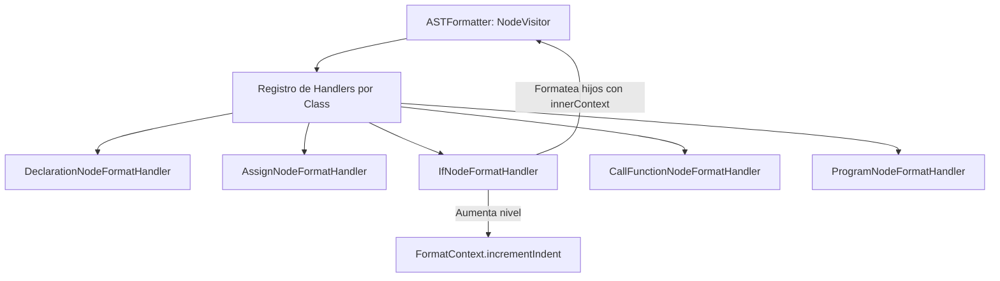

# Arquitectura y Funcionamiento de Interpreter y Formatter en PrintScript

---

## 1. Introducción y Posición en el Pipeline

En el compilador/intérprete **PrintScript**, los módulos [`com.ingsis.interpreter`](file:///home/elchurro274/Faculty/ingsis/PrintScript/com.ingsis.interpreter) y [`com.ingsis.formatter`](file:///home/elchurro274/Faculty/ingsis/PrintScript/com.ingsis.formatter) representan las dos fases finales del procesamiento de código.

Ambos actúan como **consumidores directos de las abstracciones de [`com.ingsis.common`](file:///home/elchurro274/Faculty/ingsis/PrintScript/com.ingsis.common)**:
* Consumen los nodos del Árbol de Sintaxis Abstracta ([`Node`](file:///home/elchurro274/Faculty/ingsis/PrintScript/com.ingsis.common/src/main/java/node/Node.java) y sus especializaciones).
* Interactúan mediante el patrón **Visitor** ([`NodeVisitor<R, C>`](file:///home/elchurro274/Faculty/ingsis/PrintScript/com.ingsis.common/src/main/java/node/visitor/NodeVisitor.java)).
* Utilizan los flujos seguros ([`TokenStream`](file:///home/elchurro274/Faculty/ingsis/PrintScript/com.ingsis.common/src/main/java/tokenstream/TokenStream.java)) y la mónada [`Result<T>`](file:///home/elchurro274/Faculty/ingsis/PrintScript/com.ingsis.common/src/main/java/result/Result.java) para reportar éxitos o fallos sin lanzar excepciones no controladas.



---

## 2. El Módulo Interpreter (`com.ingsis.interpreter`)

El intérprete es responsable de ejecutar las instrucciones del programa preservando las reglas de tipado, el aislamiento de ámbitos léxicos y la integración con el sistema operativo y el usuario.

### 2.1. Modos de Ejecución en `DefaultInterpreter`
La clase [`DefaultInterpreter`](file:///home/elchurro274/Faculty/ingsis/PrintScript/com.ingsis.interpreter/src/main/java/interpreter/DefaultInterpreter.java) implementa dos modalidades de ejecución:

#### A. Modo Streaming / Evaluación Perezosa ($O(1)$ en memoria)
Diseñado para ejecutar archivos gigantes o flujos de red sin almacenar el programa completo en memoria RAM:
```java
public Result<SemanticEnvironment> interpret(
        TokenStream tokenStream, SemanticEnvironment semanticEnv, Environment runtimeEnv)
```
1. **Pipeline por sentencia:** En cada iteración del bucle `while (!currentStream.isEmpty())`:
   - Parsea **una sola sentencia** a través del `statementParser`.
   - Pasa la sentencia por el `semanticChecker` para validar tipado estático y coherencia de variables.
   - Ejecuta inmediatamente la sentencia en el entorno de runtime (`statementExecutor.execute(...)`).
   - Avanza al siguiente estado del `TokenStream`.
2. **Ventaja:** Si existe un error sintáctico o semántico en la línea 100, el intérprete se detiene inmediatamente sin haber tenido que parsear las 100.000 líneas restantes del archivo.

#### B. Modo AST Completo
Ejecuta directamente un [`ProgramNode`](file:///home/elchurro274/Faculty/ingsis/PrintScript/com.ingsis.common/src/main/java/node/ProgramNode.java) previamente parseado y validado:
```java
public Result<Void> interpret(ProgramNode program, Environment globalEnv)
```
Itera sobre [`program.statements()`](file:///home/elchurro274/Faculty/ingsis/PrintScript/com.ingsis.common/src/main/java/node/ProgramNode.java#L10) delegando cada instrucción al ejecutor de sentencias.

---

### 2.2. La Tabla de Símbolos y Ámbitos Léxicos: `Environment`
En [`Environment.java`](file:///home/elchurro274/Faculty/ingsis/PrintScript/com.ingsis.interpreter/src/main/java/environment/Environment.java), la memoria de ejecución se modela como un árbol de entornos enlazados hacia su ancestro (`private final Environment parent`).

Cada entrada de variable almacena:
```java
public record VariableInfo(Object value, DataType type, boolean isMutable) {}
```

#### Reglas de Operación:
1. **Declaración (`declare`):** Registra una nueva variable en el ámbito **local actual**. Si la variable ya existe en este mismo nivel, arroja error de colisión de nombres.
2. **Reasignación (`assign`):**
   - Si la variable existe localmente: verifica si es mutable (`isMutable()`). Si es `const`, lanza `"Cannot reassign constant variable"`. Si es mutable (`let`), actualiza su valor.
   - Si no existe localmente: asciende recursivamente al padre (`parent.assign(...)`).
   - Si alcanza la raíz sin encontrarla: lanza `"Variable is not defined"`.
3. **Resolución (`get`):** Busca localmente; si no la encuentra, delega en `parent.get(...)`.
4. **Sombreado (*Variable Shadowing*):** Un bloque interno (como un `if`) puede declarar una variable con el mismo nombre que una externa sin sobrescribir la externa, pues se crea en el mapa local del entorno hijo.

---

### 2.3. Ejecución de Sentencias: `DefaultStatementExecutor`
En [`DefaultStatementExecutor.java`](file:///home/elchurro274/Faculty/ingsis/PrintScript/com.ingsis.interpreter/src/main/java/executor/DefaultStatementExecutor.java), el método `execute(Node statement, Environment env)` utiliza un `switch` polimórfico de Java sobre los tipos de nodo:

* **Declaración ([`DeclarationKeywordNode`](file:///home/elchurro274/Faculty/ingsis/PrintScript/com.ingsis.common/src/main/java/node/keyword/DeclarationKeywordNode.java)):**
  - Si tiene expresión asignada, la evalúa con el `expressionEvaluator`.
  - Registra el valor en el entorno mediante `env.declare(name, value, type, decl.isMutable())`.
* **Asignación ([`AssignNode`](file:///home/elchurro274/Faculty/ingsis/PrintScript/com.ingsis.common/src/main/java/node/keyword/AssignNode.java)):**
  - Evalúa la nueva expresión.
  - Actualiza la variable mediante `env.assign(name, newValue)`.
* **Bifurcación Condicional ([`IfKeywordNode`](file:///home/elchurro274/Faculty/ingsis/PrintScript/com.ingsis.common/src/main/java/node/keyword/IfKeywordNode.java)):**
  - Evalúa la condición y valida que sea `Boolean`.
  - Crea un nuevo entorno léxico subordinado: `Environment blockEnv = new Environment(env)`.
  - Ejecuta secuencialmente las sentencias del bloque correspondiente (`thenBody` si es `true`, `elseBody` si es `false`).
* **Llamada de Sentencia ([`CallFunctionNode`](file:///home/elchurro274/Faculty/ingsis/PrintScript/com.ingsis.common/src/main/java/node/expression/function/CallFunctionNode.java)):**
  - Evalúa los argumentos y delega en la función nativa registrada (ej: `println`).

---

### 2.4. Evaluación de Expresiones: `DefaultExpressionEvaluator`
En [`DefaultExpressionEvaluator.java`](file:///home/elchurro274/Faculty/ingsis/PrintScript/com.ingsis.interpreter/src/main/java/evaluator/DefaultExpressionEvaluator.java):
* **Literales:** Desempaqueta directamente `rawValue` de [`NumberLiteralNode`](file:///home/elchurro274/Faculty/ingsis/PrintScript/com.ingsis.common/src/main/java/node/expression/literal/NumberLiteralNode.java), [`StringLiteralNode`](file:///home/elchurro274/Faculty/ingsis/PrintScript/com.ingsis.common/src/main/java/node/expression/literal/StringLiteralNode.java) o [`BooleanLiteralNode`](file:///home/elchurro274/Faculty/ingsis/PrintScript/com.ingsis.common/src/main/java/node/expression/literal/BooleanLiteralNode.java).
* **Identificadores ([`IdentifierNode`](file:///home/elchurro274/Faculty/ingsis/PrintScript/com.ingsis.common/src/main/java/node/expression/Identifier/IdentifierNode.java)):** Extrae el valor actual desde `env.get(id.name()).value()`.
* **Operadores Binarios ([`OperatorNode`](file:///home/elchurro274/Faculty/ingsis/PrintScript/com.ingsis.common/src/main/java/node/expression/operator/OperatorNode.java)):**
  - Evalúa el subárbol izquierdo y derecho.
  - `PLUS (+)`: Si alguno de los dos operandos es `String`, concatena (`String.valueOf(left) + String.valueOf(right)`). Si ambos son números, ejecuta suma exacta mediante [`BigDecimal.add()`](file:///home/elchurro274/Faculty/ingsis/PrintScript/com.ingsis.interpreter/src/main/java/evaluator/DefaultExpressionEvaluator.java#L110).
  - `MINUS (-)`, `STAR (*)`, `SLASH (/)`: Operaciones aritméticas estrictas en `BigDecimal` (evitando imprecisiones de coma flotante).
* **Llamadas a Función ([`CallFunctionNode`](file:///home/elchurro274/Faculty/ingsis/PrintScript/com.ingsis.common/src/main/java/node/expression/function/CallFunctionNode.java)):**
  - Evalúa recursivamente cada argumento.
  - Consulta en [`FunctionRegistry`](file:///home/elchurro274/Faculty/ingsis/PrintScript/com.ingsis.interpreter/src/main/java/builtin/FunctionRegistry.java). Si es [`ReadInputFunction`](file:///home/elchurro274/Faculty/ingsis/PrintScript/com.ingsis.interpreter/src/main/java/builtin/ReadInputFunction.java) o [`ReadEnvFunction`](file:///home/elchurro274/Faculty/ingsis/PrintScript/com.ingsis.interpreter/src/main/java/builtin/ReadEnvFunction.java), invoca su método `.evaluate(args, targetType)`.

---

## 3. El Módulo Formatter (`com.ingsis.formatter`)

El formateador tiene como misión normalizar el código fuente conforme a una serie de reglas estilísticas configurables (cargadas vía YAML o pasadas programáticamente).

Para maximizar la versatilidad, el módulo implementa **dos estrategias complementarias de formateo**:
1. **`ASTFormatter`:** Formateo canónico generado a partir del Árbol de Sintaxis Abstracta (Patrón Visitor).
2. **`TokenStreamFormatter`:** Formateo preservador de fuente (*source-preserving*) que ajusta los espacios entre tokens.

---

### 3.1. Estrategia 1: Formateo Basado en AST (`ASTFormatter`)
Implementa la interfaz [`NodeVisitor<String, FormatContext>`](file:///home/elchurro274/Faculty/ingsis/PrintScript/com.ingsis.common/src/main/java/node/visitor/NodeVisitor.java) y [`Formatter`](file:///home/elchurro274/Faculty/ingsis/PrintScript/com.ingsis.formatter/src/main/java/formatter/Formatter.java).



#### Características Clave:
* **Desacoplamiento total con Handlers:** En lugar de un método gigante con condicionales, `ASTFormatter` mantiene un mapa `Map<Class<? extends Node>, FormatNodeHandler<?>>`:
  - [`DeclarationNodeFormatHandler`](file:///home/elchurro274/Faculty/ingsis/PrintScript/com.ingsis.formatter/src/main/java/formatter/handler/DeclarationNodeFormatHandler.java): Aplica reglas de espacio antes/después de los dos puntos (`:`) y alrededor del `=`.
  - [`IfNodeFormatHandler`](file:///home/elchurro274/Faculty/ingsis/PrintScript/com.ingsis.formatter/src/main/java/formatter/handler/IfNodeFormatHandler.java): Gestiona si la llave `{` va en la misma línea (`if (cond) {`) o en la línea siguiente, y genera un [`FormatContext.incrementIndent()`](file:///home/elchurro274/Faculty/ingsis/PrintScript/com.ingsis.formatter/src/main/java/formatter/FormatContext.java#L56) para que las sentencias del cuerpo se tabulen automáticamente.
  - [`ProgramNodeFormatHandler`](file:///home/elchurro274/Faculty/ingsis/PrintScript/com.ingsis.formatter/src/main/java/formatter/handler/ProgramNodeFormatHandler.java): Concatena las sentencias del programa aplicando saltos de línea configurados.
* **Formateo de Expresiones:** [`formatExpression`](file:///home/elchurro274/Faculty/ingsis/PrintScript/com.ingsis.formatter/src/main/java/formatter/ASTFormatter.java#L91) reconstruye expresiones infijas respetando `context.isSpaceAroundOperators()` (ej: `a + b` vs `a+b`).

---

### 3.2. Estrategia 2: Formateo Preservador de Tokens (`TokenStreamFormatter`)
En [`TokenStreamFormatter.java`](file:///home/elchurro274/Faculty/ingsis/PrintScript/com.ingsis.formatter/src/main/java/formatter/TokenStreamFormatter.java):
* **Problema que resuelve:** Al formatear a partir del AST puro, se descartan los comentarios del desarrollador y saltos de línea no estructurales.
* **Mecanismo:**
  1. Lee el código fuente y genera su flujo de [`Token`](file:///home/elchurro274/Faculty/ingsis/PrintScript/com.ingsis.common/src/main/java/token/Token.java).
  2. Mapea la posición exacta de cada token en el archivo original.
  3. Itera por pares de tokens consecutivos `(prev, current)` e inspecciona el texto separador entre ellos (`originalSep`).
  4. Pasa el separador por una cadena de reglas independientes ([`FormattingRule`](file:///home/elchurro274/Faculty/ingsis/PrintScript/com.ingsis.formatter/src/main/java/formatter/rule/FormattingRule.java)):
     - [`SpaceBeforeColonRule`](file:///home/elchurro274/Faculty/ingsis/PrintScript/com.ingsis.formatter/src/main/java/formatter/rule/SpaceBeforeColonRule.java): Ajusta espacios antes de `:`.
     - [`SpaceAfterColonRule`](file:///home/elchurro274/Faculty/ingsis/PrintScript/com.ingsis.formatter/src/main/java/formatter/rule/SpaceAfterColonRule.java): Ajusta espacios después de `:`.
     - [`SpaceAroundEqualsRule`](file:///home/elchurro274/Faculty/ingsis/PrintScript/com.ingsis.formatter/src/main/java/formatter/rule/SpaceAroundEqualsRule.java): Asegura espacios alrededor de `=`.
     - [`SpaceAroundOperatorsRule`](file:///home/elchurro274/Faculty/ingsis/PrintScript/com.ingsis.formatter/src/main/java/formatter/rule/SpaceAroundOperatorsRule.java): Normaliza espacios en `+`, `-`, `*`, `/`.
     - [`BracePositionRule`](file:///home/elchurro274/Faculty/ingsis/PrintScript/com.ingsis.formatter/src/main/java/formatter/rule/BracePositionRule.java): Coloca `{` en la misma línea o en línea inferior.
     - [`IndentationRule`](file:///home/elchurro274/Faculty/ingsis/PrintScript/com.ingsis.formatter/src/main/java/formatter/rule/IndentationRule.java): Calcula y aplica la sangría de espacios según la profundidad de bloques `{ }`.
     - [`LinesAfterPrintlnRule`](file:///home/elchurro274/Faculty/ingsis/PrintScript/com.ingsis.formatter/src/main/java/formatter/rule/LinesAfterPrintlnRule.java): Inserta líneas en blanco luego de invocar `println`.

---

### 3.3. Configuración del Formateador: `FormatContext` y YAML
La configuración de formato es modelada inmutablemente por [`FormatContext`](file:///home/elchurro274/Faculty/ingsis/PrintScript/com.ingsis.formatter/src/main/java/formatter/FormatContext.java):

```java
public record FormatContext(
        int indentLevel,
        Integer indentSpaces,            // Ej: 2 o 4 espacios
        Boolean spaceBeforeColon,        // Ej: false -> let x: number
        Boolean spaceAfterColon,         // Ej: true  -> let x: number
        Boolean spaceAroundEquals,       // Ej: true  -> x = 5
        Boolean spaceAroundOperators,    // Ej: true  -> 10 + 20
        Boolean lineBreakAfterStatement,
        Integer lineBreaksAfterPrintln,  // Ej: 1 línea en blanco
        Boolean singleSpaceSeparation,
        Boolean ifBraceSameLine,         // true -> if (c) {
        Boolean ifBraceBelowLine         // true -> if (c)\n{
)
```

Mediante [`YamlFormatRulesLoader.loadFromYaml(InputStream stream)`](file:///home/elchurro274/Faculty/ingsis/PrintScript/com.ingsis.formatter/src/main/java/formatter/config/YamlFormatRulesLoader.java), se parsea directamente un archivo YAML estándar:
```yaml
indentation: 4
spaceBeforeColon: false
spaceAfterColon: true
spaceAroundEquals: true
spaceAroundOperators: true
ifBraceSameLine: true
lineBreaksAfterPrintln: 1
```

---

## 4. Cuadro Comparativo de Responsabilidades

| Dimensión | `com.ingsis.interpreter` | `com.ingsis.formatter` |
|---|---|---|
| **Propósito Principal** | Ejecutar la semántica del programa y producir efectos | Normalizar la presentación estética del código fuente |
| **Entrada Principal** | `ProgramNode` (AST) o `TokenStream` bajo demanda | `ProgramNode` (`ASTFormatter`) o `InputStream` (`TokenStreamFormatter`) |
| **Manejo de Contexto** | [`Environment`](file:///home/elchurro274/Faculty/ingsis/PrintScript/com.ingsis.interpreter/src/main/java/environment/Environment.java) con variables, valores y puntero a `parent` | [`FormatContext`](file:///home/elchurro274/Faculty/ingsis/PrintScript/com.ingsis.formatter/src/main/java/formatter/FormatContext.java) con reglas de sangría y espaciado |
| **Patrón Clave** | Dispatch polimórfico / Strategy / Inyección de dependencias | Visitor polimórfico ([`NodeVisitor`](file:///home/elchurro274/Faculty/ingsis/PrintScript/com.ingsis.common/src/main/java/node/visitor/NodeVisitor.java)) y Handlers desacoplados |
| **I/O del Sistema** | Captura entrada con `InputProvider` y salida con `outputEmitter` | Escribe código fuente formateado en un `Writer` |
| **Manejo de Fallos** | Retorna [`Result.failure(error)`](file:///home/elchurro274/Faculty/ingsis/PrintScript/com.ingsis.common/src/main/java/result/Result.java#L14) ante tipos incompatibles o variables no declaradas | Retorna [`Result.failure(error)`](file:///home/elchurro274/Faculty/ingsis/PrintScript/com.ingsis.common/src/main/java/result/Result.java#L14) si la estructura del AST o stream es inválida |
| **Extensibilidad** | Registro de nuevas funciones en `FunctionRegistry` | Registro de nuevos handlers o nuevas `FormattingRule` |
