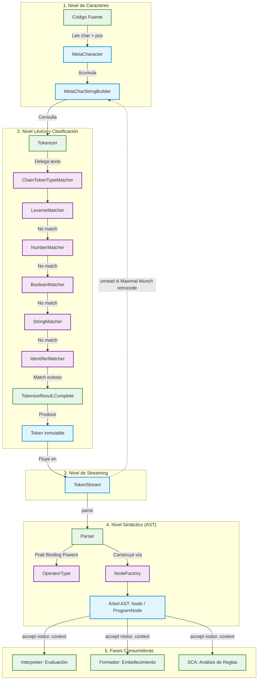

# Sistema de `com.ingsis.common` — Arquitectura, Decisiones de Diseño y Funcionamiento

---

## 1. Introducción: ¿Qué es `common` en PrintScript?

En la arquitectura de un compilador/intérprete modular, los distintos subsistemas (análisis léxico, sintáctico, semántico, interpretación, formateo de código y análisis estático) deben interactuar de forma coordinada pero sin acoplarse directamente entre sí.

El módulo **`com.ingsis.common`** actúa como el **Shared Kernel (Núcleo Compartido)** y la **Capa de Dominio Base** de PrintScript. Sus características fundamentales a nivel de sistema son:

1. **Cero Dependencias Externas:** No depende de ningún otro módulo del proyecto (`charstream`, `lexer`, `parser`, etc.) ni de bibliotecas de terceros (solo Java SE estándar). Es la cúspide de la pirámide de dependencias.
2. **Fuente Única de la Verdad (Single Source of Truth):** Todos los contratos sintácticos, modelos de datos atómicos, estructuras de control de errores y definiciones de nodos residen exclusivamente aquí.
3. **Desacoplamiento Polimórfico:** Permite que el `lexer` produzca tokens y el `parser` los consuma sin que ninguno conozca la implementación interna del otro, comunicándose únicamente a través de las abstracciones `Token`, `TokenStream` y `SafeIterator`.

---

## 2. ¿Qué Implementa? Catálogo Estructural y de Abstracciones

El módulo está organizado en 10 paquetes altamente cohesivos:

```
com.ingsis.common/src/main/java/
├── result/            # Mónada de control de flujo y manejo funcional de errores
├── iterator/          # Abstracción de evaluación perezosa (Streaming I/O)
├── position/          # Coordenadas espaciales inmutables en código fuente
├── metaChar/          # Caracteres con metadatos de posición y buffers de tokenización
├── token/             # Modelos de tokens, tipos y delimitadores
│   ├── tokenize/      # Resultados intermedios de tokenización incremental
│   ├── tokenizer/     # Contrato funcional para analizadores léxicos
│   └── matcher/       # Cadena de Responsabilidad para clasificación de tokens
│       └── chain/     # Ensamblado y fachada de la cadena de matchers
├── node/              # Jerarquía de Árbol de Sintaxis Abstracta (AST)
│   ├── expression/    # Expresiones, literales, operadores y llamadas
│   ├── keyword/       # Sentencias de declaración, asignación y control de flujo
│   ├── factory/       # Fábrica centralizada de nodos del AST
│   └── visitor/       # Contrato del patrón Visitor para recorrido desacoplado
├── parser/            # Interfaz funcional genérica de parsing
├── environment/       # Contrato de tabla de símbolos / ámbito de variables
├── state/             # Estados finitos de reconocimiento incremental
└── version/           # Soporte de versiones evolutivas del lenguaje (1.0 vs 1.1)
```

### 2.1. Paquete `result`: Mónada de Control de Fallos Funcional
* **`Result<T>`** (`sealed interface`): Representa el resultado de una computación que puede ser exitosa o fallar. Solo permite dos implementaciones:
  * **`CorrectResult<T>(T value)`** (`record`): Encapsula un valor generado exitosamente.
  * **`IncorrectResult<T>(String error)`** (`record`): Encapsula el mensaje descriptivo del fallo.
* Proporciona métodos fábrica estáticos `Result.success(val)` y `Result.failure(err)`.

### 2.2. Paquete `iterator`: Streaming y Evaluación Perezosa
* **`SafeIterator<T>`** (`interface`): Contrato para iteradores que retornan `Result<IterationStep<T>>` en cada paso de `next()`. Incluye el método `default void unread(T item)` para permitir el retorno (*pushback*) de elementos ya consumidos.
* **`IterationStep<T>`** (`record`): Tupla inmutable `(T value, SafeIterator<?> next)` que asocia el valor producido en el paso actual con el iterador avanzado al siguiente estado. Proporciona el método genérico helper `<S extends SafeIterator<?>> S nextStream()`.

### 2.3. Paquetes `position` y `metaChar`: Trazabilidad Espacial
* **`Position(Integer line, Integer column)`** (`record`): Coordenadas inmutables 1-indexed. Su método `toString()` formatea `[line:column]`.
* **`MetaCharacter(Character character, Position position)`** (`record`): Asociación indivisible entre un carácter individual y su coordenada espacial original.
* **`MetaCharacterStringBuilder`** (`sealed interface`): Contrato para acumuladores de caracteres posicionales.
* **`MetaCharStringBuilder`** (`final class`): Acumulador mutable que registra automáticamente la posición del **primer** carácter insertado (`position`), y acumula el texto en un `StringBuilder` interno. Si está vacío, su posición se inicializa con `(-1, -1)`.

### 2.4. Paquete `token`: Vocabulario y Clasificación Léxica
* **`TokenType`** (`enum`): Tipos léxicos del lenguaje:
  * Control y especiales: `NONE`, `NULL`.
  * Palabras clave: `LET`, `CONST`, `IF`, `ELSE`, `PRINTLN`.
  * Tipos de dato: `NUMBER`, `STRING`, `BOOLEAN`.
  * Literales: `NUMBER_LITERAL`, `STRING_LITERAL`, `BOOLEAN_LITERAL`.
  * Símbolos y operadores: `PLUS`, `MINUS`, `STAR`, `SLASH`, `EQUAL`.
  * Delimitadores: `LPAREN`, `RPAREN`, `LBRACE`, `RBRACE`, `COLON`, `SEMICOLON`, `COMMA`.
  * Identificadores: `IDENTIFIER`.
* **`TokenInterface`** (`interface`): Contrato con `type()`, `value()`, `startPosition()`, `endPosition()`, `line()`, `column()`, `isNull()`.
* **`Token`** (`record`): Implementación estándar inmutable de `TokenInterface`.
* **`SymbolType`** (`enum`): Mapeo bidireccional entre literales tipográficos (`"="`, `":"`, `";"`, `"("`, `")"`, `"{"`, `"}"`, `","`) y sus correspondientes `TokenType`. Permite inspecciones `isSymbol(...)` y búsquedas `fromToken(...)` y `fromTokenType(...)`.
* **`TokenizeResult`** (`sealed interface`): Representa el estado de matching al procesar un token:
  * `Complete(Token token)`: Se ha completado un token legítimo.
  * `Prefix()`: La secuencia leída hasta ahora es un prefijo legal de un token más largo.
  * `Invalid(String reason)`: La secuencia no puede formar ningún token válido.
* **`Tokenizer`** (`@FunctionalInterface`): Firma `TokenizeResult tokenize(MetaCharStringBuilder sb)`.
* **Cadena de Matchers (`token.matcher` & `chain`):**
  * `TokenTypeMatcher` (`interface`): `Result<TokenType> match(String input)`.
  * `AbstractTokenTypeMatcher` (`abstract class`): Esqueleto de Chain of Responsibility con método de enlace `linkWith(...)`, método plantilla `match(...)` con `switch (result)` y delegación `passToNext(...)`.
  * Matchers concretos: `LexemeMatcher` (keywords y símbolos en hash map `O(1)`), `NumberMatcher` (expresión regular numérica), `BooleanMatcher` (`true`/`false`), `StringMatcher` (cadenas con comillas y escapes), `IdentifierMatcher` (nombres de variables/funciones).
  * `ChainTokenTypeMatcher`: Fábrica que ensambla la cadena en orden estricto de especificidad.
  * `TokenMatcher`: Fachada estática pública (`TokenMatcher.match(input)`).

### 2.5. Paquete `tokenstream`: Abstracción de Consumo para el Parser
* **`TokenStream`** (`interface` extiende `SafeIterator<Token>`):
  * `consume()`: Avanza al siguiente token.
  * `consume(TokenType expectedType)`: Consume el siguiente token solo si coincide con el tipo esperado.
  * `consume(Predicate<Token> matcher)`: Consume si cumple el predicado.
  * `peek(int offset)`: Mira hacia adelante sin avanzar el puntero.
  * `isEmpty()` y `pointer()`: Estado actual del flujo.

### 2.6. Paquete `node`: Jerarquía del Árbol de Sintaxis Abstracta (AST)
* **`Node`** (`interface`): Raíz de la jerarquía Composite. Exige `line()`, `column()`, `symbol()`, `children()` y define el método de despacho del patrón Visitor:
  ```java
  default <R, C> R accept(NodeVisitor<R, C> visitor, C context) {
      return visitor.visitDefault(this, context);
  }
  ```
* **`ProgramNode`** (`record`): Nodo raíz contenedor de sentencias (`List<Node> statements`). Hace copia defensiva inmutable con `List.copyOf`.
* **Expresiones (`node.expression`):**
  * `ExpressionNode` (`interface` extiende `Node`): Especialización para nodos que evalúan a un valor.
  * `LiteralNode<T>` (`interface` extiende `ExpressionNode`): Contrato genérico con `Result<T> value()`.
  * `NumberLiteralNode(BigDecimal rawValue, ...)`: Literales numéricos con precisión arbitraria.
  * `StringLiteralNode(String rawValue, ...)`: Literales de texto.
  * `BooleanLiteralNode(Boolean rawValue, ...)`: Literales booleanos.
  * `IdentifierNode(String name, ...)`: Uso de identificadores.
  * `CallFunctionNode(IdentifierNode, List<ExpressionNode>, ...)`: Invocación de funciones (ej. `println`).
  * `NilExpressionNode()`: Representación del **Null Object** para variables declaradas sin asignación (`let x: number;`).
  * `OperatorNode(OperatorType, ExpressionNode left, ExpressionNode right, ...)`: Nodo de operación binaria.
  * `OperatorType` (`enum`): Define símbolos (`+`, `-`, `*`, `/`, `=`) y sus respectivas potencias de unión izquierda y derecha (`lBindingPower`, `rBindingPower`) para el algoritmo de Pratt Parsing.
  * `DataType` (`enum`): Tipos soportados (`NUMBER`, `STRING`, `BOOLEAN`).
* **Sentencias (`node.keyword`):**
  * `DeclarationKeywordNode`: Declaración de variable (`let`/`const`, nombre, expresión asignada, tipo declarado opcional).
  * `DeclarationType` (`enum`): `LET("let", true)` vs `CONST("const", false)`.
  * `AssignNode`: Reasignación de valor (`x = expr`).
  * `IfKeywordNode`: Sentencia condicional con condición, bloque `thenBody` y bloque `elseBody`.
* **`NodeFactory`** (`final class`): Métodos factoría centralizados (`createIdentifier`, `createDeclaration`, `createAssign`, `createCall`, `createIf`, `createOperator`, `createProgram`) que extraen automáticamente las coordenadas del `Token` para construir los nodos.
* **`NodeVisitor<R, C>`** (`interface`): Contrato del patrón Visitor con métodos `visit(...)` específicos para cada tipo de nodo y `visitDefault(...)` para nodos genéricos.

### 2.7. Paquetes `parser`, `environment`, `state` y `version`
* **`Parser<T>`** (`@FunctionalInterface`): Firma `Result<IterationStep<T>> parse(TokenStream stream)`.
* **`Scope<K, V>`** (`interface`): Contrato para ambientes léxicos con `declare`, `assign`, `get`, `contains`.
* **`State`** (`enum`): `INVALID`, `PREFIX`, `COMPLETE` para autómatas de estado léxico.
* **`Version`** (`enum`): `V_1_0`, `V_1_1` con parseo desde cadena de texto (`fromString`).

---

## 3. ¿Por qué se tomaron esas Decisiones de Diseño?

Las decisiones arquitectónicas de `common` no son accidentales; responden a principios rigurosos de ingeniería de software para sistemas de compilación:

| Decisión de Diseño | Alternativa Descartada | Justificación Técnica y Beneficio |
|---|---|---|
| **1. Mónada `Result<T>` sellada** | `throw new CompilerException(...)` | **Cero excepciones para control de flujo.** Las excepciones en Java degradan el rendimiento al instanciar stacktraces y rompen la predictibilidad del flujo (saltos no locales). Con `Result` sellado (`sealed`), el compilador de Java fuerza al programador a usar Pattern Matching exhaustivo (`switch`), garantizando que **ningún error léxico, sintáctico o semántico sea ignorado silenciosamente**. |
| **2. Evaluación Perezosa (`SafeIterator<T>`)** | Colecciones en memoria (`List<Token>`, `String sourceCode`) | **Consumo de memoria $O(1)$.** En compiladores que procesan archivos de gigabytes o flujos de red continuos, cargar el código completo causa `OutOfMemoryError`. `SafeIterator` solo materializa el elemento actual (`IterationStep`), procesando en streaming carácter a carácter y token a token. |
| **3. Inmutabilidad Total con Records** | JavaBeans con setters/getters | **Thread-Safety y Ausencia de Efectos Secundarios.** Los nodos del AST, tokens y posiciones son Value Objects. El uso de Java `record` garantiza inmutabilidad por defecto, eliminando bugs causados por mutaciones accidentales del AST durante las pasadas del analizador semántico o formateador. Además, colecciones internas usan `List.copyOf(...)`. |
| **4. Lookahead Pushback (`unread`)** | Re-lectura de archivos o buffers gigantes | **Algoritmo Maximal Munch.** El lexer necesita leer un carácter extra para saber si un token ha finalizado (ej. distinguir `let` de `letter`, o `=` de `==`). Si el acumulado deja de ser válido, `unread()` permite devolver caracteres al stream sin romper la abstracción ni reiniciar el flujo desde el disco. |
| **5. Cadena de Responsabilidad para Tokens** | Gran bloque monolítico `if-else` o `switch` con regexes | **Principio Open/Closed (OCP).** Clasificar tokens requiere un orden estricto de precedencia: primero palabras clave y símbolos fijos (`LexemeMatcher`), luego literales (`Number`, `Boolean`, `String`), y finalmente identificadores genéricos (`IdentifierMatcher`). La cadena desacopla cada regla en una clase aislada y testeable; agregar un nuevo literal no modifica el código existente. |
| **6. Pratt Parsing Binding Powers en `OperatorType`** | Gramáticas recursivas extensas por nivel de precedencia | **Simplicidad y Eficiencia en Análisis de Expresiones.** La técnica de Pratt asigna potencias numéricas (`lBindingPower`, `rBindingPower`) directamente al operador. Esto elimina la necesidad de crear decenas de reglas intermedias en la gramática (`Term`, `Factor`, `Comparison`, etc.) y resuelve naturalmente la asociatividad a izquierda o derecha. |
| **7. Patrón Null Object (`NilExpressionNode`)** | Retornar `null` en `expressionNode` de declaraciones | **Eliminación de `NullPointerException`.** En `let x: number;`, no hay expresión asignada. Si se usara `null`, cada visitante (intérprete, formateador, SCA) requeriría validaciones defensivas `if (node.expression() != null)`. Al implementar `NilExpressionNode`, el nodo responde normalmente a `symbol()`, `children()` y visitas sin riesgos de desreferenciación nula. |
| **8. Patrón Visitor con Genéricos `<R, C>`** | Métodos `.execute()` o `.format()` dentro de los nodos del AST | **Separación de Responsabilidades (SRP).** El AST solo debe representar la estructura sintáctica del programa. Si pusiéramos la lógica de ejecución, formateo y reglas de linter dentro de `AssignNode`, los nodos estarían ultra acoplados a todas las fases. El Visitor permite que el módulo `interpreter`, `formatter` o `sca` definan sus operaciones externamente sin alterar una sola línea de `node`. |
| **9. Precisión Numérica con `BigDecimal`** | Tipos primitivos `double` o `float` | **Exactitud Aritmética.** Las operaciones de punto flotante binario estándar (IEEE 754) introducen imprecisiones conocidas (ej. `0.1 + 0.2 = 0.30000000000000004`). `NumberLiteralNode` encapsula `BigDecimal`, preservando la precisión exacta definida por el usuario en el código fuente. |
| **10. Centrado en Posición Espacial (`Position`, `MetaCharacter`)** | Guardar solo el texto plano | **Mensajes de Error y Reglas de Linter Precisas.** El compilador necesita reportar la línea y columna exacta de cada error. Los formateadores y reglas de análisis estático (SCA) dependen de las posiciones espaciales para verificar convenciones de espaciado e indentación. `MetaCharacter` vincula el carácter a su coordenada desde el primer microsegundo de lectura. |
| **11. Patrón Factory (`NodeFactory`)** | Instanciación directa con `new` en el parser | **Abstracción y Reducción de Ruido.** Construir nodos AST manualmente requiere extraer repetidamente `line` y `column` del token inicial. `NodeFactory` centraliza la política de mapeo entre tokens y nodos, reduciendo duplicación de código en los parsers sintácticos. |

---

## 4. ¿Cómo Funciona el Sistema? Flujos e Interacciones

El módulo `common` establece el pipeline a través del cual los datos son procesados por las diferentes fases del compilador.



### 4.1. Flujo Paso a Paso de una Instrucción

Tomemos como ejemplo la sentencia: `let total: number = 10 + 20;`

#### Paso A: Del Stream de Caracteres a `MetaCharacter`
1. El subsistema `charstream` lee el archivo y emite objetos `MetaCharacter('l', Position(1, 1))`, `MetaCharacter('e', Position(1, 2))`, etc.
2. Estos caracteres son acumulados secuencialmente en un `MetaCharStringBuilder`.
3. El builder registra `Position(1, 1)` como su coordenada de inicio y mantiene el buffer interno `"let"`.

#### Paso B: Clasificación por la Cadena de Responsabilidad
1. El lexer consulta al `Tokenizer`, pasándole el buffer acumulado.
2. El `Tokenizer` delega a `TokenMatcher.match("let")`.
3. `LexemeMatcher` recibe `"let"`, consulta su tabla estática, comprueba que es una palabra reservada y responde inmediatamente `Result.success(TokenType.LET)`.
4. El matcher retorna un `TokenizeResult.Complete(new Token(TokenType.LET, "let", Position(1,1), Position(1,4)))`.
5. Si el lexer lee el siguiente carácter y ve un espacio o símbolo que corta el token, el token queda cerrado. Si se hubiera leído un carácter inesperado, el mecanismo `SafeIterator.unread()` devuelve los caracteres adicionales al stream.

#### Paso C: Ingesta en el `TokenStream` y Análisis Sintáctico
1. Los tokens son emitidos a través de una implementación de `TokenStream`.
2. El `Parser` asignado invoca `stream.consume(TokenType.LET)`.
3. Si el token entrante coincide, obtiene `Result.success(IterationStep(token, nextStream))`.
4. El parser consume el identificador `total`, el delimitador `:`, el tipo `number`, el operador `=`, y delega la expresión `10 + 20` al algoritmo de Pratt.

#### Paso D: Resolución de Precedencia con Pratt Parsing (`OperatorType`)
1. El parser de expresiones procesa el literal `10` (`NumberLiteralNode`).
2. Encuentra el operador `+`. Consulta `OperatorType.fromSymbol("+")`, que le proporciona:
   - `lBindingPower = 12`
   - `rBindingPower = 11`
3. Si la expresión fuera `10 + 20 * 30`, al encontrar `*`, consulta su `lBindingPower = 22`. Dado que `22 > 11`, el parser liga el subárbol `20 * 30` como hijo derecho de `+`, garantizando la precedencia matemática sin requerir backtracking ni gramáticas infladas.

#### Paso E: Construcción Inmutable del AST vía `NodeFactory`
1. Una vez identificadas las partes, el parser invoca `NodeFactory.createDeclaration(...)`.
2. La fábrica ensambla un `DeclarationKeywordNode` conteniendo:
   - `declarationType = DeclarationType.LET`
   - `identifierNode = IdentifierNode("total", 1, 5)`
   - `expressionNode = OperatorNode(PLUS, NumberLiteralNode(10), NumberLiteralNode(20), 1, 24)`
   - `declaredType = DataType.NUMBER`
   - Coordenadas espaciales extraídas directamente del token `let`.
3. Las declaraciones del archivo son recopiladas en un `ProgramNode` con copia defensiva inmutable.

#### Paso F: Despacho Polimórfico mediante `NodeVisitor`
1. Los módulos cliente ejecutan sus operaciones invocando `programNode.accept(visitor, context)`.
2. Cada nodo en la jerarquía redirige la llamada al método correspondiente en el visitante:
   - `DeclarationKeywordNode` invoca `visitor.visit(this, context)`.
   - `AssignNode` invoca `visitor.visit(this, context)`.
   - `IfKeywordNode` invoca `visitor.visit(this, context)`.
3. El contexto (`C`) viaja a lo largo del árbol permitiendo:
   - En **Interpreter**: Pasar el `Scope` actual para registrar variables y evaluar valores.
   - En **Formatter**: Pasar la configuración de indentación y saltos de línea para reconstruir el código.
   - En **SCA**: Pasar el reporte de alertas para verificar convenciones de nombres (*camelCase*) o restricciones idiomáticas (*no println en producción*).

---

## 5. Guía de Extensibilidad: Cómo Evolucionar el Sistema

El diseño modular de `common` permite extender el lenguaje siguiendo patrones limpios y sin romper código existente:

### 5.1. Agregar un nuevo Operador (ej: Módulo `%`)
1. **En `TokenType`:** Agregar `PERCENT` al enum.
2. **En `OperatorType`:** Agregar `MODULO("%", 22, 21)` con su binding power deseado (misma precedencia que multiplicación y división).
3. **En `LexemeMatcher`:** Agregar `Map.entry("%", TokenType.PERCENT)` al mapa estático.
4. **Resultado:** El lexer lo tokeniza automáticamente y el Pratt parser lo estructura con la precedencia correcta sin tocar la lógica de parsing.

### 5.2. Agregar una nueva Sentencia Sintáctica (ej: Bucle `WhileKeywordNode`)
1. **En `token.TokenType`:** Agregar `WHILE`.
2. **En `token.matcher.LexemeMatcher`:** Agregar `"while"` al mapa.
3. **En `node.keyword`:** Crear el record `WhileKeywordNode(ExpressionNode condition, List<Node> body, Integer line, Integer column) implements Node`.
4. **En `node.visitor.NodeVisitor`:** Agregar el método de visita `R visit(WhileKeywordNode node, C context);`.
5. **En `node.factory.NodeFactory`:** Exponer el método factoría `createWhile(ExpressionNode cond, List<Node> body, Token token)`.

### 5.3. Agregar un nuevo Tipo de Literal (ej: Float de Punto Flotante o Carácter)
1. **En `node.expression.literal`:** Crear el record correspondiente implementando `LiteralNode<T>`.
2. **En `token.matcher`:** Crear un matcher que herede de `AbstractTokenTypeMatcher`.
3. **En `ChainTokenTypeMatcher`:** Incorporar el nuevo matcher en el encadenamiento `defaultChain()`.

---

## 6. Conclusión

El módulo `com.ingsis.common` es la piedra angular sobre la que se erige todo el ecosistema de **PrintScript**. Al combinar:
- **Tipado algebraico estricto** (`Result<T>`),
- **Inmutabilidad determinista** (`record` de Java),
- **Evaluación perezosa eficiente** (`SafeIterator<T>`),
- **Desacoplamiento de responsabilidades** (Visitor, Chain of Responsibility, Pratt Parsing, Null Object y Factory),

se logra una arquitectura de software limpia, robusta, altamente testeable, libre de excepciones descontroladas y preparada para evolucionar de manera transparente a lo largo de múltiples versiones de especificación.
