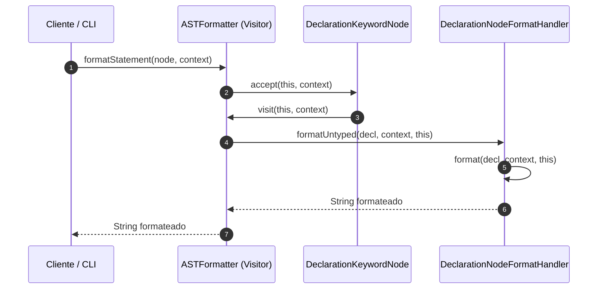

# Modulo com.ingsis.formatter

## Descripcion General

El modulo `com.ingsis.formatter` es el componente de PrintScript encargado del formateo de codigo fuente y de la aplicacion de politicas de estilo predefinidas o configuradas por el usuario.

El modulo provee dos estrategias complementarias de formateo:
1. **`TokenStreamFormatter` (Formateo Basado en Tokens)**: Procesa directamente un flujo de tokens (`InputStream`) generado por el Lexer, aplicando reglas sobre los separadores y preservando la fidelidad del archivo original.
2. **`ASTFormatter` (Formateo Basado en AST)**: Recorre la estructura sintactica del `ProgramNode` o cualquier `Node` individual utilizando el patron **Visitor** y un conjunto desacoplado de manejadores (`FormatNodeHandler`), generando una representacion textual canonica del arbol.

---

## Dependencias del Modulo

Definidas en [build.gradle](file:///home/elchurro274/Faculty/ingsis/PrintScript/com.ingsis.formatter/build.gradle):

| Modulo / Libreria | Tipo | Proposito |
| :--- | :--- | :--- |
| `com.ingsis.common` | `implementation` | Nodos del AST, tokens, tipos de simbolos y monada `Result<T>`. |
| `com.ingsis.charstream` | `implementation` | Lector de flujo de caracteres con posicion. |
| `com.ingsis.lexer` | `implementation` | Tokenizacion de codigo fuente para `TokenStreamFormatter`. |
| `org.yaml:snakeyaml` | `implementation` | Lectura y parsing de reglas de formato definidas en archivos YAML. |

---

## Arquitectura y Componentes

```
com.ingsis.formatter/
├── src/main/java/formatter/
│   ├── Formatter.java                          # Interfaz unificada de formateo
│   ├── FormatContext.java                      # Registro inmutable con las reglas de estilo activas
│   ├── ASTFormatter.java                       # Visitor sobre el AST con despacho a handlers
│   ├── TokenStreamFormatter.java               # Formateador basado en stream y reglas de separacion
│   ├── config/
│   │   └── YamlFormatRulesLoader.java          # Carga de reglas desde un InputStream YAML
│   ├── handler/
│   │   ├── FormatNodeHandler.java              # Interfaz generica para handlers de nodos
│   │   ├── DeclarationNodeFormatHandler.java   # Formateo de declaraciones (let / const)
│   │   ├── AssignNodeFormatHandler.java        # Formateo de asignaciones
│   │   ├── IfNodeFormatHandler.java            # Formateo de bloques if / else
│   │   ├── CallFunctionNodeFormatHandler.java  # Formateo de llamadas a funciones (println)
│   │   └── ProgramNodeFormatHandler.java       # Formateo de la lista de sentencias del programa
│   └── rule/
│       ├── FormattingRule.java                 # Interfaz de reglas sobre tokens adyacentes
│       ├── SpaceBeforeColonRule.java           # Espaciado previo a los dos puntos (:)
│       ├── SpaceAfterColonRule.java            # Espaciado posterior a los dos puntos (:)
│       ├── SpaceAroundEqualsRule.java          # Espaciado alrededor del signo igual (=)
│       ├── SpaceAroundOperatorsRule.java       # Espaciado alrededor de operadores (+, -, *, /)
│       ├── LineBreakAfterStatementRule.java    # Salto de linea obligatorio tras punto y coma (;)
│       ├── LinesAfterPrintlnRule.java          # Cantidad de saltos de linea tras println(...)
│       ├── SingleSpaceSeparationRule.java      # Normalizacion a espacio simple
│       ├── IndentationRule.java                # Sangria dentro de bloques segun profundidad
│       └── BracePositionRule.java              # Posicion de llaves { en la misma linea o debajo
```

---

## Estrategias de Formateo

### 1. `ASTFormatter` (Patron Visitor + Handlers Polimorficos)

`ASTFormatter` implementa `NodeVisitor<String, FormatContext>` y delega cada nodo a su respectivo `FormatNodeHandler`:



### 2. `TokenStreamFormatter` (Pipeline Basado en Reglas)

Lee el stream de caracteres, tokeniza el contenido y ajusta unicamente los separadores (espacios, tabulaciones y saltos de linea) entre tokens consecutivos sin reconstruir el texto de los literales ni de los identificadores:

1. **Tokenizacion**: Extrae la lista de tokens via `Lexer`.
2. **Calculo de offsets**: Mapea los indices de inicio y fin de cada token en el codigo original.
3. **Aplicacion de reglas**: Para cada par `(tokenAnterior, tokenActual)`, itera sobre la lista de `FormattingRule` aplicables (`applies`) y computa el separador resultante (`formatSeparator`).
4. **Emision y escritura**: Escribe el resultado directamente en el `Writer` provisto.

---

## Configuracion de Reglas (YAML)

El loader [`YamlFormatRulesLoader`](file:///home/elchurro274/Faculty/ingsis/PrintScript/com.ingsis.formatter/src/main/java/formatter/config/YamlFormatRulesLoader.java) soporta las siguientes opciones:

| Clave YAML | Tipo | Descripcion |
| :--- | :--- | :--- |
| `space-before-colon` / `enforce-spacing-before-colon-in-declaration` | Boolean | Espacio antes de `:` en declaraciones (`let x : number`). |
| `space-after-colon` / `enforce-spacing-after-colon-in-declaration` | Boolean | Espacio despues de `:` en declaraciones (`let x: number`). |
| `space-around-equals` / `enforce-spacing-around-equals` | Boolean | Espacios alrededor del `=` (`x = 5` vs `x=5`). |
| `enforce-no-spacing-around-equals` | Boolean | Deshabilita espacios alrededor del `=`. |
| `space-around-operators` / `mandatory-space-surrounding-operations` | Boolean | Espacios alrededor de operadores (`a + b`). |
| `line-break-after-statement` / `mandatory-line-break-after-statement` | Boolean | Salto de linea obligatorio despues de cada `;`. |
| `line-breaks-after-println` / `line-breaks-before-println` | Integer | Cantidad de saltos de linea requeridos tras un `println`. |
| `indent-inside-if` / `indent-spaces` | Integer | Cantidad de espacios de sangria dentro de bloques `if`. |
| `if-brace-same-line` | Boolean | Llave `{` en la misma linea (`if (...) {`). |
| `if-brace-below-line` | Boolean | Llave `{` en la linea siguiente (`if (...)\n{`). |

---

## Patrones de Diseno Aplicados

| Patron | Aplicacion en el Modulo |
| :--- | :--- |
| **Visitor** | `ASTFormatter` implementa `NodeVisitor` para recorrer la jerarquia del AST sin acoplar la logica de formato a los nodos. |
| **Strategy** | `FormattingRule` desacopla cada regla sintactica individual en una estrategia independiente y componible. |
| **Bridge / Double Dispatch** | `FormatNodeHandler.formatUntyped()` actua como puente polimorfico para procesar nodos sin requerir casteo explicito en el visitante. |
| **Immutable Record** | `FormatContext` encapsula el estado de configuracion y sangria de manera inmutable. |
| **Factory / Loader** | `YamlFormatRulesLoader` centraliza el parseo y adaptacion de opciones desde archivos YAML hacia el contexto de ejecucion. |
