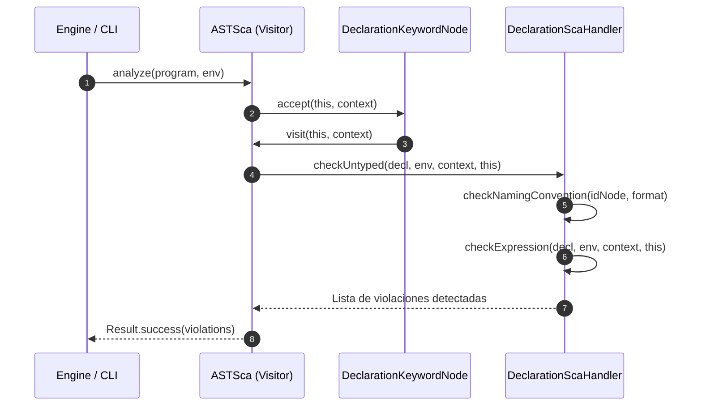

# Modulo com.ingsis.sca (Static Code Analysis / Linter)

## Descripcion General

El modulo `com.ingsis.sca` es el analizador estatico de codigo (*Static Code Analyzer* o *Linter*) del lenguaje PrintScript. Su funcion principal es evaluar un AST construido previamente por el parser para comprobar el cumplimiento de convenciones de estilo, nomenclatura y restricciones estructurales que van mas alla de la validez sintactica o semantica del programa.

A diferencia del parser (que valida si un programa es gramaticalmente correcto y bien tipado), el SCA audita si el programa respeta las directivas de buenas practicas y convenciones corporativas o de cátedra configuradas (por ejemplo: formato de identificadores `camelCase` o `snake_case`, o la prohibicion de pasar expresiones complejas como argumento a funciones del sistema).

---

## Dependencias del Modulo

Definidas en [build.gradle](file:///home/elchurro274/Faculty/ingsis/PrintScript/com.ingsis.sca/build.gradle):

| Modulo / Libreria | Tipo | Proposito |
| :--- | :--- | :--- |
| `com.ingsis.common` | `implementation` | Jerarquia de nodos AST (`Node`, `ProgramNode`, `DeclarationKeywordNode`, etc.), entorno semantico (`SemanticEnvironment`) y monada `Result<T>`. |
| `org.yaml:snakeyaml` | `implementation` | Lectura y carga de reglas de linter desde archivos YAML. |

---

## Arquitectura y Componentes

```
com.ingsis.sca/
├── src/main/java/sca/
│   ├── Sca.java                               # Interfaz principal del analizador
│   ├── ScaContext.java                        # Record inmutable con las reglas activas
│   ├── ASTSca.java                            # Visitor que orquesta el analisis sobre el AST
│   ├── config/
│   │   └── YamlScaRulesLoader.java            # Carga desacoplada de reglas desde YAML
│   └── handler/
│       ├── ScaNodeHandler.java                # Interfaz generica para analizadores por nodo
│       ├── DeclarationScaHandler.java         # Auditoria de nomenclatura en variables (camel/snake)
│       ├── CallFunctionScaHandler.java        # Auditoria de argumentos en llamadas (println, readInput)
│       ├── IfScaHandler.java                  # Recorrido y analisis de bloques condicionales
│       └── ProgramScaHandler.java             # Analisis secuencial de sentencias del programa
```

---

## Reglas Soportadas y Configuracion YAML

El loader [`YamlScaRulesLoader`](file:///home/elchurro274/Faculty/ingsis/PrintScript/com.ingsis.sca/src/main/java/sca/config/YamlScaRulesLoader.java) lee las configuraciones desde un archivo o stream YAML e inicializa el [`ScaContext`](file:///home/elchurro274/Faculty/ingsis/PrintScript/com.ingsis.sca/src/main/java/sca/ScaContext.java):

```yaml
# Ejemplo de archivo de configuracion de SCA
identifier_format: "camel case"                  # o "snake case"
mandatory-variable-or-literal-in-println: true     # Prohibe expresiones compuestas en println
mandatory-variable-or-literal-in-readInput: true   # Prohibe expresiones compuestas en readInput
```

### 1. Convencion de Nombres de Identificadores (`identifier_format`)
* **`camel case` / `camelcase`**: Exige que todo nombre de variable respete la expresion regular `^[a-z]+(?:[A-Z][a-z0-9]*)*$`.
* **`snake case` / `snake_case`**: Exige que todo nombre de variable respete la expresion regular `^[a-z]+(?:_[a-z0-9]+)*$`.
* **Violacion generada**: Emite un mensaje con el nombre del identificador, la convencion esperada y las coordenadas exactas de linea y columna en el codigo fuente.

### 2. Restriccion de Argumentos en `println` y `readInput`
* **Regla**: Cuando `mandatory-variable-or-literal-in-println` o `mandatory-variable-or-literal-in-readInput` esta activada, cada argumento enviado a dicha funcion debe ser un literal atomico (`LiteralNode`) o una variable (`IdentifierNode`).
* **Violacion generada**: Si se envia una expresion calculada (por ejemplo `println("Hola " + nombre);` o `println(5 + 3);`), el linter lo rechaza informando el indice del argumento y la posicion donde se encuentra la expresion.

---

## Flujo de Evaluacion (Patron Visitor + Handlers)

`ASTSca` implementa `NodeVisitor<List<String>, ScaContext>` y despacha la revision de cada tipo de nodo a un [`ScaNodeHandler<T>`](file:///home/elchurro274/Faculty/ingsis/PrintScript/com.ingsis.sca/src/main/java/sca/handler/ScaNodeHandler.java):



---

## Patrones de Diseno Aplicados

| Patron | Implementacion y Beneficio |
| :--- | :--- |
| **Visitor** | `ASTSca` recorre la estructura heterogenea del AST desacoplando las reglas de auditoria de los nodos sintacticos. |
| **Command / Strategy (Handlers)** | `ScaNodeHandler<T>` aisla cada regla por tipo de nodo (`DeclarationScaHandler`, `CallFunctionScaHandler`, etc.), permitiendo extender o sustituir validaciones sin modificar el visitante principal. |
| **Bridge / Double Dispatch** | `checkUntyped` efectua el cast seguro al tipo de nodo `T`, garantizando seguridad de tipos en tiempo de compilacion sin codigo duplicado. |
| **Immutable Context (Record)** | `ScaContext` modela las opciones de auditoria como un registro inmutable, previniendo efectos secundarios entre llamadas. |
| **Monad Result** | Las operaciones de analisis retornan `Result<List<String>>`, asegurando un tratamiento determinista y funcional de los resultados. |
